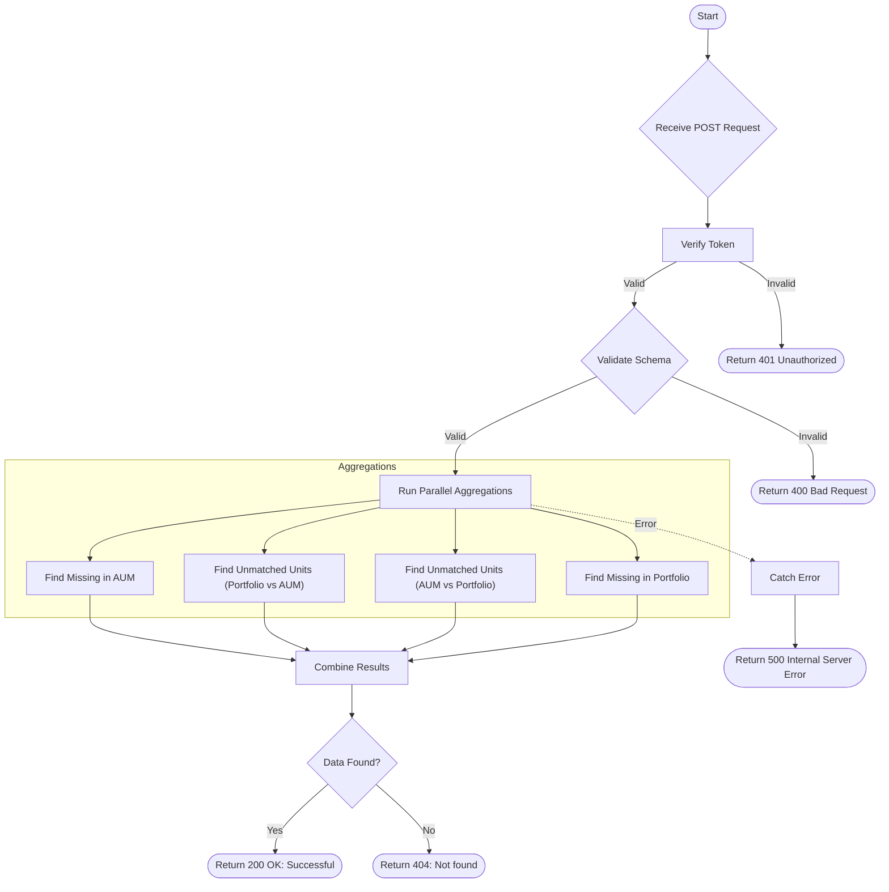

# AUM Calculate
Calculates discrepancies between FolioWise Portfolio data and AUM Upload data. It identifies missing records in either dataset and records with mismatched unit counts.

### User flow diagram


### Method
```
POST
```

### Route
```
/aum/aum-calculate
```

### Authorization
```
Bearer <token>
```

### Request Body
```json
{
    "productCode": ["PRODUCT1", "PRODUCT2"]
}
```

### Response `Status: (200)`
```json
{
    "status": true,
    "message": "Successful",
    "payload": {
        "length": 4,
        "aumValue": [
            {
                "folio": "12345/67",
                "product": "PRODUCT1",
                "scheme": "Scheme Name",
                "rta": "CAMS",
                "aum_applicant": "",
                "foliowise_appicant": "Applicant Name",
                "foliowise_unit": 100,
                "aum_unit": "",
                "aum_date": "",
                "difference_in_unit": "",
                "status": "missing",
                "nature": "not exists in aum",
                "schemecode": "SCH001",
                "gpan": "ABCDE1234F",
                "pan": "ABCDE1234F"
            },
            {
                "folio": "98765/43",
                "product": "PRODUCT2",
                "scheme": "Another Scheme",
                "rta": "KARVY",
                "aum_applicant": "Client Name",
                "foliowise_appicant": "Client Name",
                "aum_unit": 150,
                "foliowise_unit": 140,
                "aum_date": "01-01-2024",
                "difference_in_unit": 10,
                "status": "unmatched",
                "nature": "exists in db",
                "schemecode": "SCH002",
                "gpan": "ZNMPQ1234R",
                "pan": "ZNMPQ1234R"
            }
        ]
    }
}
```

### Response `Status: (404)`
```json
{
    "status": false,
    "message": "Not found"
}
```

### Response `Status: (500)`
```json
{
    "status": false,
    "message": "Internal Server Error"
}
```
