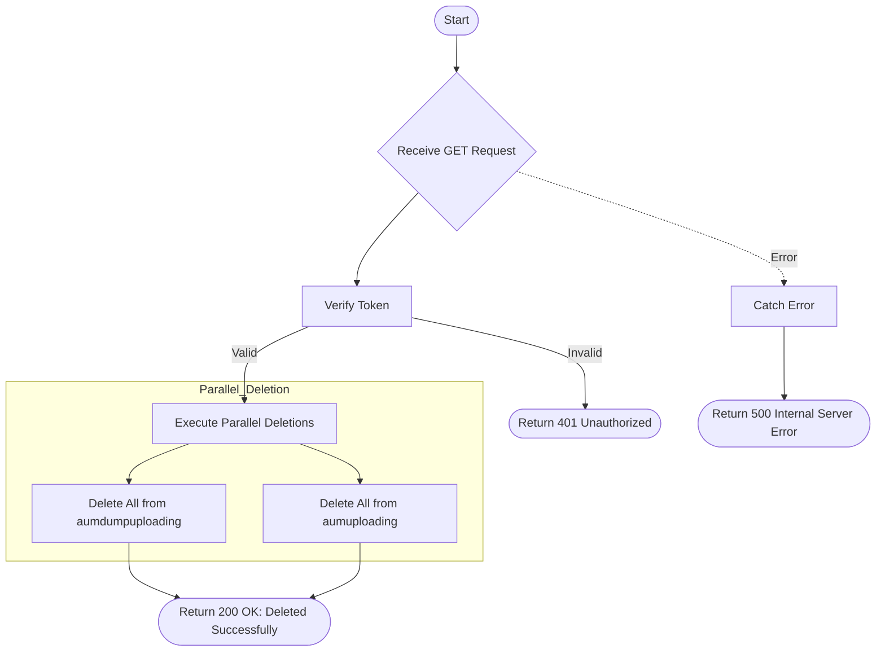

# Delete AUM
Deletes all AUM (Assets Under Management) data from both the dump uploading and uploading collections in parallel.

### User flow diagram


### Method
```
GET
```

### Route
```
/delete-aum
```

### Authorization
```
Bearer <token>
```

### Parameters
| Name | Type | Description |
|------|------|-------------|
| None | - | - |

### Sample Request
```http
GET: https://<host>/delete-aum
```

### Response `Status: (200)`
```json
{
    "status": true,
    "message": "Deleted Successfully"
}
```

### Response `Status: (500)`
```json
{
    "status": false,
    "message": "Internal Server Error"
}
```
