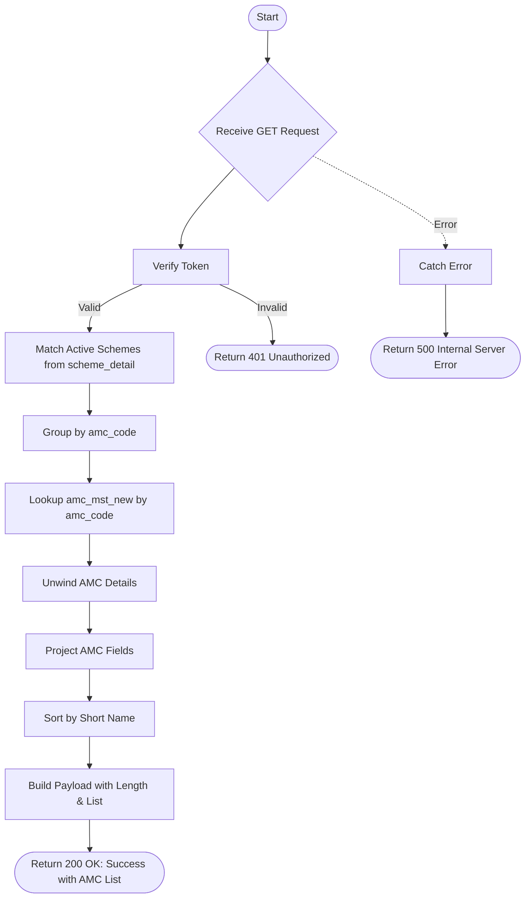

# List AUM AMC
Retrieves a list of all AMCs (Asset Management Companies) that have active schemes, including their short names, ACCORD AMC codes, AMC codes, and RTA information.

### User flow diagram


### Method
```
GET
```

### Route
```
/list-aum-amc
```

### Authorization
```
Bearer <token>
```

### Parameters
| Name | Type | Description |
|------|------|-------------|
| None | - | - |

### Sample Request
```http
GET: https://<host>/list-aum-amc
```

### Response `Status: (200)`
```json
{
    "status": true,
    "message": "Success",
    "payload": {
        "length": 45,
        "amcList": [
            {
                "AMC_SHORTNAME": "Aditya Birla SL AMC",
                "ACCORD_AMC": "AB",
                "AMC": "AB001",
                "RTA": "CAMS"
            },
            {
                "AMC_SHORTNAME": "HDFC AMC",
                "ACCORD_AMC": "HD",
                "AMC": "HD001",
                "RTA": "CAMS"
            },
            {
                "AMC_SHORTNAME": "ICICI Prudential AMC",
                "ACCORD_AMC": "IP",
                "AMC": "IP001",
                "RTA": "KARVY"
            }
        ]
    }
}
```

### Response `Status: (500)`
```json
{
    "status": false,
    "message": "Internal Server Error"
}
```
