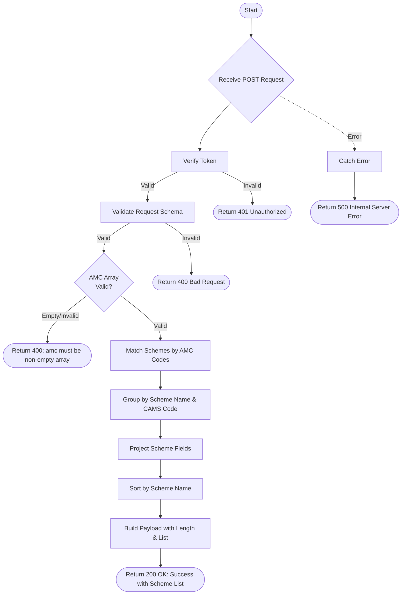

# List AUM Scheme
Retrieves a list of schemes for specified AMC codes, including scheme names and product codes, grouped by unique scheme-product combinations.

### User flow diagram


### Method
```
POST
```

### Route
```
/list-aum-scheme
```

### Authorization
```
Bearer <token>
```

### Request Body
```json
{
    "amc": ["AB001", "HD001", "IP001"]
}
```

**Note:** `amc` must be a non-empty array of AMC codes.

### Response `Status: (200)`
```json
{
    "status": true,
    "message": "Success",
    "payload": {
        "length": 125,
        "schemeList": [
            {
                "SCHEMENAME": "Aditya Birla Sun Life Equity Fund",
                "PRODUCTCODE": "AB-EQ-001"
            },
            {
                "SCHEMENAME": "HDFC Balanced Advantage Fund",
                "PRODUCTCODE": "HD-BA-002"
            },
            {
                "SCHEMENAME": "ICICI Prudential Bluechip Fund",
                "PRODUCTCODE": "IP-BC-003"
            }
        ]
    }
}
```

### Response `Status: (400)`
```json
{
    "status": false,
    "message": "amc must be a non-empty array"
}
```

### Response `Status: (500)`
```json
{
    "status": false,
    "message": "Internal Server Error"
}
```
