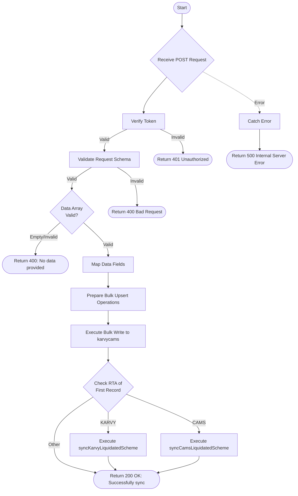

# Sync from AUM Reconciliation
Syncs reconciliation data from AUM inputs into the consolidated `karvycams` collection. It processes a list of records, maps them to the required format, performs bulk upsert operations, and triggers liquidation syncs for the specific RTA found in the data.

### User flow diagram


### Method
```
POST
```

### Route
```
/reconcilation-sync
```

### Authorization
```
Bearer <token>
```

### Request Body
```json
{
    "data": [
        {
            "folio": "12345/67",
            "product": "P001",
            "rta": "CAMS",
            "foliowise_appicant": "Investor Name",
            "gpan": "ABCDE1234F",
            "pan": "ABCDE1234F",
            "schemecode": "S001",
            "rm": "RM Name",
            "rmid": "RM001",
            "ASSETTYPE": "Equity",
            "SCHEME": "Scheme Name"
        }
    ]
}
```

### Response `Status: (200)`
```json
{
    "status": true,
    "message": "Successfully sync"
}
```

### Response `Status: (400)`
```json
{
    "status": false,
    "message": "No data provided for sync"
}
```

### Response `Status: (500)`
```json
{
    "status": false,
    "message": "Internal Server Error"
}
```
