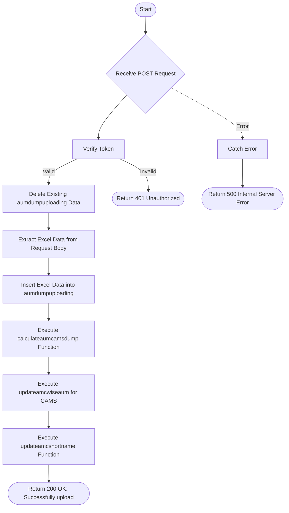

# Upload AUM CAMS
Uploads AUM (Assets Under Management) data for CAMS RTA by clearing existing dump data, inserting new Excel data, calculating AUM from the dump, updating AMC-wise AUM totals, and updating AMC short names.

### User flow diagram


### Method
```
POST
```

### Route
```
/upload-aum-cams
```

### Authorization
```
Bearer <token>
```

### Request Body
```json
[
    {
        "field1": "value1",
        "field2": "value2",
        "field3": "value3"
    },
    {
        "field1": "value1",
        "field2": "value2",
        "field3": "value3"
    }
]
```

**Note:** Request body should contain an array of AUM data objects extracted from Excel file.

### Response `Status: (200)`
```json
{
    "status": true,
    "message": "Successfully upload"
}
```

### Response `Status: (500)`
```json
{
    "status": false,
    "message": "Internal Server Error"
}
```
