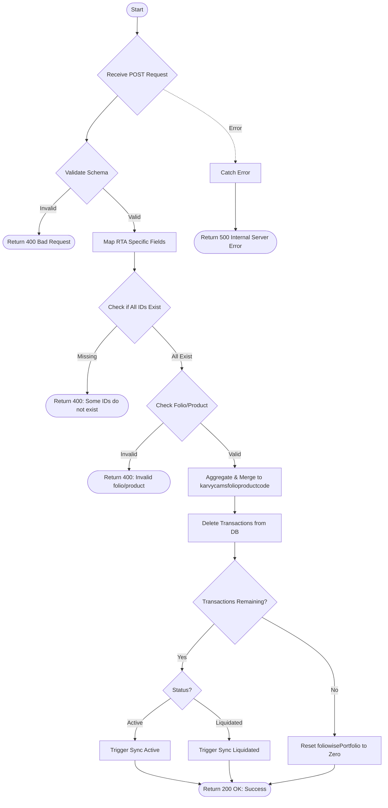

# Delete Transaction
Deletes specific transaction records for a given folio and product code. It performs a soft backup of the deleted transactions into the `karvycamsfolioproductcode` collection before deletion. After deletion, it either triggers a synchronization (if transactions remain) or resets the portfolio values to zero (if no transactions remain).

### User flow diagram


### Method
```
POST
```

### Route
```
/delete-transaction
```

### Authorization
```
Bearer <token>
```

### Request Body
```json
{
    "ids": ["60d5ecb8b4873434788b4567", "60d5ecb8b4873434788b4568"],
    "rta": "CAMS",
    "status": "Active",
    "folio": "12345/67",
    "product": "P001"
}
```

### Response `Status: (200)`
```json
{
    "status": true,
    "message": "Success"
}
```

### Response `Status: (400)`
```json
{
    "status": false,
    "message": "Some transaction IDs do not exist in database"
}
```

### Response `Status: (500)`
```json
{
    "status": false,
    "message": "Internal Server Error"
}
```
