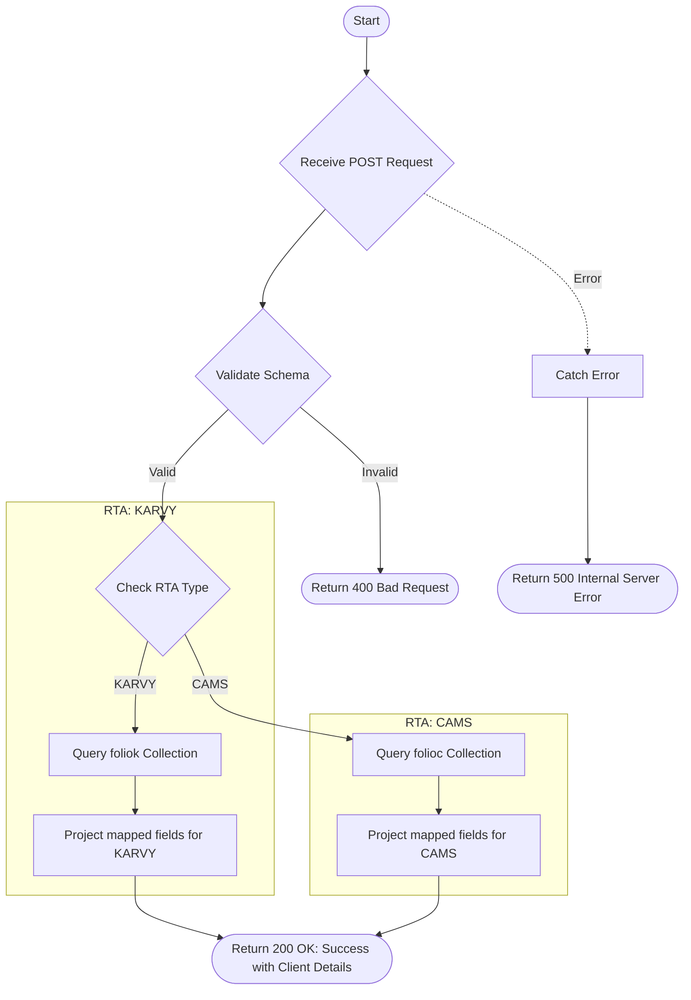

# Folio Full Detail
Retrieves comprehensive personal and bank details of a client associated with a specific folio, RTA, and product code. It supports both CAMS and KARVY registrars.

### User flow diagram


### Method
```
POST
```

### Route
```
/folio-full-detail
```

### Authorization
```
Bearer <token>
```

### Request Body
```json
{
    "folio": "1234567/89",
    "rta": "CAMS",
    "product": "P001"
}
```

### Parameters
| Name | Type | Description |
|------|------|-------------|
| folio | String | The folio number to retrieve details for. |
| rta | String | The registrar (e.g., "CAMS", "KARVY"). |
| product | String | The product code associated with the folio. |

### Response `Status: (200)`
```json
{
    "status": true,
    "message": "Success",
    "payload": {
        "length": 1,
        "clientDetails": {
            "FOLIO": "1234567/89",
            "NAME": "John Doe",
            "DOB": "01-01-1980",
            "ADD1": "Street Name",
            "ADD2": "Building",
            "ADD3": "Area",
            "CITY": "Mumbai",
            "PINCODE": "400001",
            "SCHEME": "HDFC Liquid Fund",
            "JTNAME1": "",
            "JTNAME2": "",
            "NOMINEE1": "Jane Doe",
            "NOMINEE2": "",
            "NOMINEE3": "",
            "BANK": "HDFC Bank",
            "BANKACCOUNt": "123456789",
            "IFSC": "HDFC00001",
            "PAN": "ABCDE1234F",
            "TAX_STATUS": "Individual",
            "PHONE_OFF": "",
            "PHONE_RES": "",
            "MOBILE": "9876543210",
            "EMAIL": "john.doe@example.com",
            "HOLDING": "Single",
            "JT1_PAN": "",
            "JT2_PAN": "",
            "GUARD_PAN": "",
            "GUARD_NAME": "",
            "COUNTRY": "INDIA",
            "AC_TYPE": "Savings"
        }
    }
}
```

### Response `Status: (400)`
```json
{
    "status": false,
    "message": "Validation Error"
}
```

### Response `Status: (500)`
```json
{
    "status": false,
    "message": "Internal Server Error"
}
```
