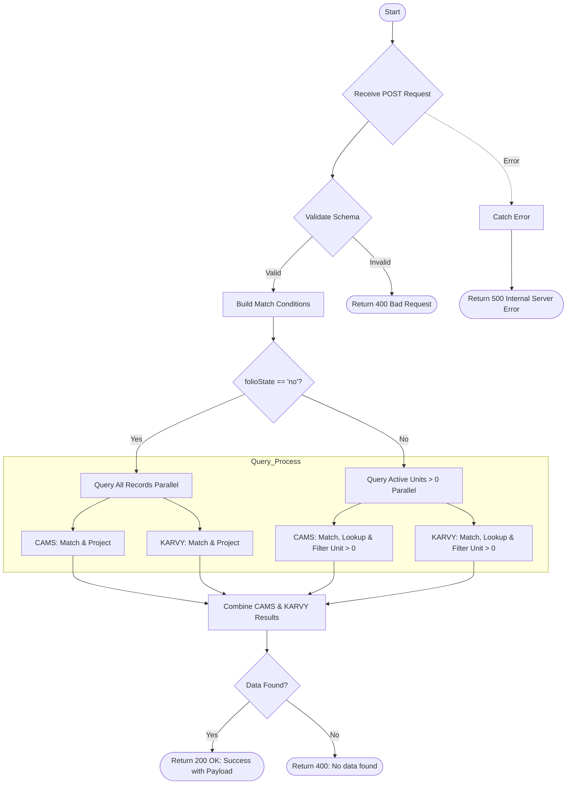

# Folio Lookup
Searches for folio details across CAMS and KARVY databases based on provided criteria (Folio, Name, PAN, Guard PAN, Scheme Code). It filters results based on the 'folioState' parameter—fetching all records if set to "no", or only records with active units (> 0) otherwise.

### User flow diagram


### Method
```
POST
```

### Route
```
/folio-lookup
```

### Authorization
```
Bearer <token>
```

### Request Body
```json
{
    "folio": "12345/67",
    "name": "Investor Name",
    "pan": "ABCDE1234F",
    "gpan": "",
    "schemecode": "S001",
    "folioState": "yes"
}
```

**Note:** At least one search parameter should be provided. `folioState` defaults to "yes" (active units only) if not set to "no".

### Response `Status: (200)`
```json
{
    "status": true,
    "message": "Success",
    "payload": {
        "length": 1,
        "clientDetails": [
            {
                "NAME": "John Doe",
                "PAN": "ABCDE1234F",
                "FOLIO": "12345/67",
                "PRODCODE": "P001",
                "SCHEME": "HDFC Equity Fund",
                "UNIT": 100.50,
                "AUM": 15000.00,
                "EMAIL": "john@example.com",
                "MOBILE": "9876543210",
                "DOB": "1990-01-01",
                "MODEOFHOLD": "Single",
                "STATUS": "Individual",
                "ADD1": "123 Main St",
                "CITY": "Mumbai",
                "BANK": "HDFC Bank",
                "ACCOUNT": "0011223344",
                "IFSC": "HDFC0000123",
                "RTA": "CAMS"
            }
        ]
    }
}
```

### Response `Status: (400)`
```json
{
    "status": false,
    "message": "No data found"
}
```

### Response `Status: (500)`
```json
{
    "status": false,
    "message": "Internal Server Error"
}
```
