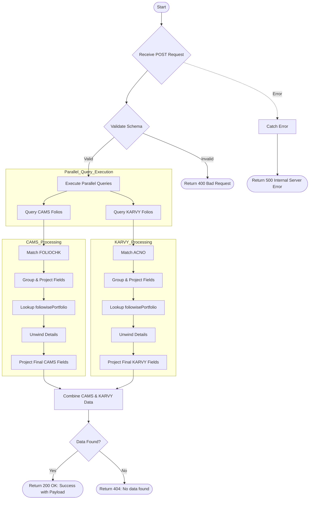

# Client Folio Detail
Retrieves detailed folio information for a specific folio number from both CAMS and KARVY RTA databases. It aggregates data including PAN, Name, Scheme details, Units, and current value date.

### User flow diagram


### Method
```
POST
```

### Route
```
/folio-short-detail
```

### Authorization
```
Bearer <token>
```

### Request Body
```json
{
    "searchvalue": "1234567/89"
}
```

### Response `Status: (200)`
```json
{
    "status": true,
    "message": "Success",
    "payload": {
        "length": 2,
        "folioDetails": [
            {
                "PAN": "ABCDE1234F",
                "GPAN": "ABCDE1234F",
                "FOLIO": "1234567/89",
                "PRODCODE": "P001",
                "SCHEME": "HDFC Liquid Fund",
                "NAME": "John Doe",
                "UNIT": 100.50,
                "RTA": "CAMS",
                "SCHEMECODE": "S001",
                "STATUS": "Active",
                "DATE": "20-12-2025",
                "JOINT1_PAN": "XYZDE1234F",
                "JOINT2_PAN": ""
            }
        ]
    }
}
```

### Response `Status: (404)`
```json
{
    "status": false,
    "message": "No data found"
}
```

### Response `Status: (500)`
```json
{
    "status": false,
    "message": "Internal Server Error"
}
```
