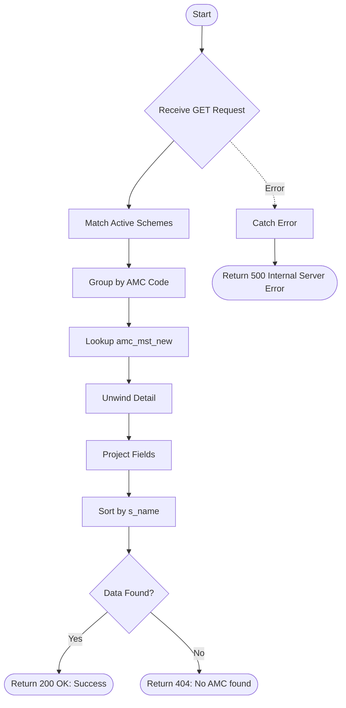

# Get AMC
Retrieves a list of active Asset Management Companies (AMCs) by aggregating active schemes and looking up AMC master details.

### User flow diagram


### Method
```
GET
```

### Route
```
/get-amc
```

### Authorization
```
None
```

### Parameters
| Name | Type | Description |
|------|------|-------------|
| None | - | - |

### Sample Request
```http
GET: https://<host>/get-amc
```

### Response `Status: (200)`
```json
{
    "status": true,
    "message": "AMC found Successfully",
    "payload": {
        "length": 2,
        "amcList": [
            {
                "s_name": "Aditya Birla SL AMC",
                "amc_code": "AB001",
                "rtamccode": "AB",
                "rta": "CAMS"
            },
            {
                "s_name": "HDFC AMC",
                "amc_code": "HD001",
                "rtamccode": "HD",
                "rta": "CAMS"
            }
        ]
    }
}
```

### Response `Status: (404)`
```json
{
    "status": false,
    "message": "No AMC found"
}
```

### Response `Status: (500)`
```json
{
    "status": false,
    "message": "Internal Server Error"
}
```
