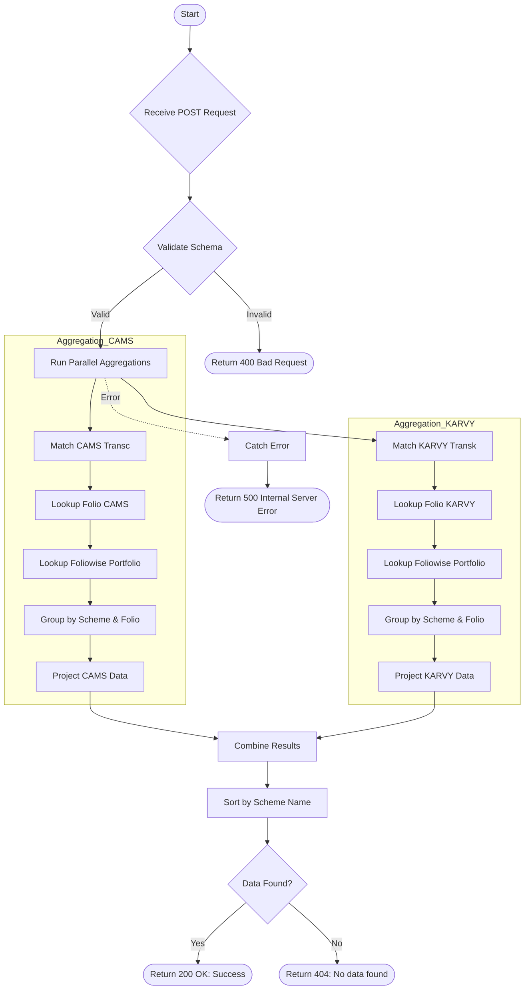

# Get Client Detail
Fetch detailed portfolio information for a client given their name and PAN. Aggregates data from both CAMS and KARVY sources.

### User flow diagram


### Method
```
POST
```

### Route
```
/get-client-detail
```

### Authorization
```
None
```

### Request Body
```json
{
    "name": "Client Name",
    "pan": "ABCDE1234F"
}
```

### Response `Status: (200)`
```json
{
    "status": true,
    "message": "Success",
    "payload": {
        "length": 2,
        "clientDetails": [
            {
                "PAN": "ABCDE1234F",
                "SCHEME": "Scheme A",
                "FOLIO": "12345/67",
                "PRODCODE": "P001",
                "NAME": "Client Name",
                "UNIT": 100,
                "RTA": "CAMS",
                "SCHEMECODE": "SCH001",
                "GPAN": "",
                "STATUS": "OK",
                "DATE": "01-01-2024"
            },
            {
                "PAN": "ABCDE1234F",
                "SCHEME": "Scheme B",
                "FOLIO": "98765/43",
                "PRODCODE": "P002",
                "NAME": "Client Name",
                "UNIT": 50,
                "RTA": "KARVY",
                "SCHEMECODE": "SCH002",
                "GPAN": "",
                "STATUS": "OK",
                "DATE": "01-01-2024"
            }
        ]
    }
}
```

### Response `Status: (404)`
```json
{
    "status": false,
    "message": "No data  found"
}
```

### Response `Status: (500)`
```json
{
    "status": false,
    "message": "Internal Server Error"
}
```
