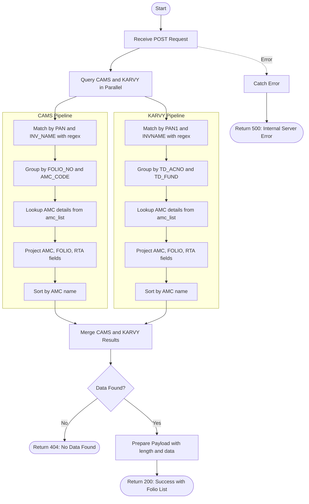

# Get Folio
Retrieves all unique folios associated with a specific PAN and investor name combination. The API searches across both CAMS and KARVY transaction collections, groups folios by AMC (Asset Management Company), enriches results with AMC long names via lookup, and returns a sorted list of folios with their respective RTAs.

### User flow diagram


### Method
```
POST
```

### Route
```
/folio/getfolio
```

### Authorization
```
None (No token required)
```

### Request Body
```json
{
    "pan": "ABCDE1234F",
    "name": "John Doe"
}
```

### Parameters
| Name | Type | Description |
|------|------|-------------|
| pan | String | **Required**. The PAN of the investor. Must match exactly. |
| name | String | **Required**. The name of the investor. Performs prefix-based search (starts with). |

### Response `Status: (200)`
```json
{
    "status": true,
    "message": "Success",
    "payload": {
        "length": 5,
        "data": [
            {
                "AMC": "Aditya Birla Sun Life Mutual Fund",
                "FOLIO": "1234567/89",
                "RTA": "CAMS"
            },
            {
                "AMC": "HDFC Mutual Fund",
                "FOLIO": "9876543/21",
                "RTA": "CAMS"
            },
            {
                "AMC": "ICICI Prudential Mutual Fund",
                "FOLIO": "5555555/55",
                "RTA": "KARVY"
            },
            {
                "AMC": "SBI Mutual Fund",
                "FOLIO": "1111111/11",
                "RTA": "CAMS"
            },
            {
                "AMC": "UTI Mutual Fund",
                "FOLIO": "2222222/22",
                "RTA": "KARVY"
            }
        ]
    }
}
```

### Response `Status: (404)`
```json
{
    "status": false,
    "message": "No Data Found"
}
```

### Response `Status: (500)`
```json
{
    "status": false,
    "message": "Error message details"
}
```

## API Behavior Details

### Authentication & Authorization
- **No Authentication**: This endpoint does not require a bearer token
- **No Access Control**: No RM-based filtering applied

### Search Logic
- **PAN Match**: Exact match on PAN field
- **Name Match**: Prefix-based regex search (starts with) on investor name
- **Case Insensitive**: Name search is case-insensitive using `$options: 'i'`
- **Combined Filter**: Both PAN and name must match

### Data Aggregation Pipeline

#### CAMS Pipeline Stages:
1. **Match**: Filters transactions by `PAN` and `INV_NAME` (prefix regex)
2. **Group**: Groups by unique `FOLIO_NO` and `AMC_CODE` combination
3. **Lookup**: Joins with `amc_list` collection to get AMC details
4. **Unwind**: Flattens the AMC lookup results
5. **Project**: Formats output with AMC long name, folio, and RTA
6. **Sort**: Sorts results alphabetically by AMC name

#### KARVY Pipeline Stages:
1. **Match**: Filters transactions by `PAN1` and `INVNAME` (prefix regex)
2. **Group**: Groups by unique `TD_ACNO` and `TD_FUND` combination
3. **Lookup**: Joins with `amc_list` collection to get AMC details
4. **Unwind**: Flattens the AMC lookup results
5. **Project**: Formats output with AMC long name, folio, and RTA
6. **Sort**: Sorts results alphabetically by AMC name

### Field Mapping

| Field | CAMS Collection | KARVY Collection | Output Field |
|-------|----------------|------------------|--------------|
| PAN | `PAN` | `PAN1` | - |
| Investor Name | `INV_NAME` | `INVNAME` | - |
| Folio Number | `FOLIO_NO` | `TD_ACNO` | `FOLIO` |
| AMC Code | `AMC_CODE` | `TD_FUND` | - |
| AMC Name | Lookup from `amc_list.long_name` | Lookup from `amc_list.long_name` | `AMC` |
| RTA | "CAMS" (hardcoded) | "KARVY" (hardcoded) | `RTA` |

### Collections Queried
- **trans_cams**: CAMS transaction collection
- **trans_karvy**: KARVY transaction collection
- **amc_list**: AMC master list for lookup

### Data Processing
1. **Parallel Execution**: Queries both CAMS and KARVY simultaneously
2. **Deduplication**: Grouping ensures unique folio-AMC combinations per RTA
3. **Enrichment**: AMC codes are enriched with full AMC names via lookup
4. **Sorting**: Results are sorted alphabetically by AMC name within each RTA
5. **Merge**: Combines results from both RTAs into a single array

### Use Cases
- Display all folios for a specific investor
- Folio selection dropdown in UI
- Investor folio verification
- Portfolio overview by AMC
- Client onboarding and KYC verification
- Folio consolidation analysis

### Response Fields
- **AMC**: Full name of the Asset Management Company
- **FOLIO**: Folio number
- **RTA**: Registrar and Transfer Agent (CAMS or KARVY)
- **length**: Total number of unique folios found across both RTAs

### Notes
- Results are sorted alphabetically by AMC name for better readability
- Each folio appears only once per RTA (deduplicated by grouping)
- AMC names are fetched from the master `amc_list` collection
- No date range filtering applied - searches across all historical transactions
