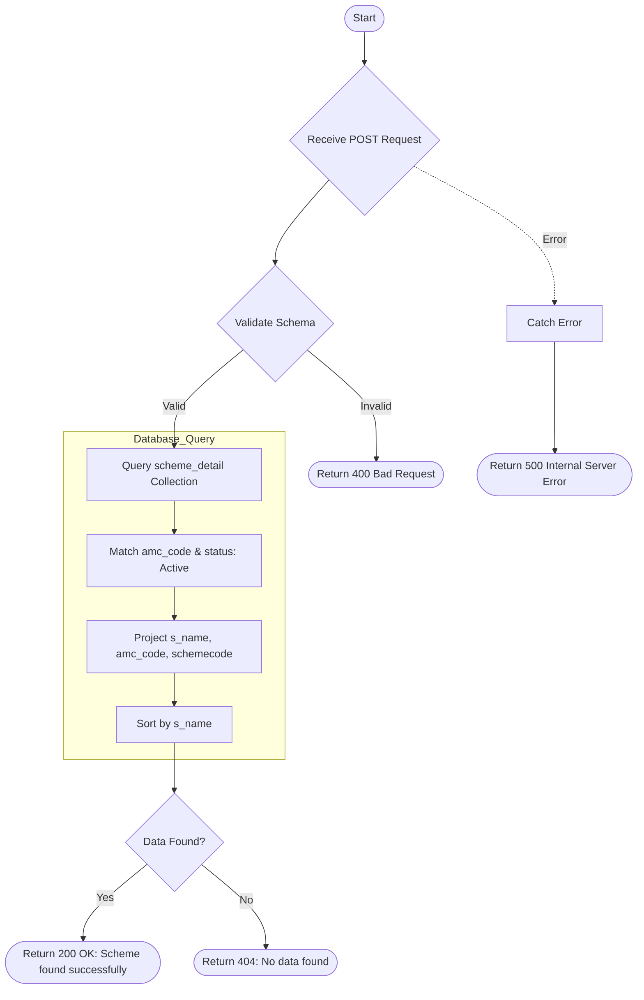

# Get Scheme
Retrieves a list of schemes based on the AMC code provided. The schemes are filtered to include only those with an "Active" status and are sorted by scheme name.

### User flow diagram


### Method
```
POST
```

### Route
```
/get-scheme
```

### Authorization
```
Bearer <token>
```

### Request Body
```json
{
    "amccode": "AMC123"
}
```

### Parameters
| Name | Type | Description |
|------|------|-------------|
| amccode | String | The AMC code to filter schemes. |

### Response `Status: (200)`
```json
{
    "status": true,
    "message": "Scheme found successfully",
    "payload": {
        "length": 1,
        "schemeDetails": [
            {
                "s_name": "Axis Bluechip Fund",
                "amc_code": "AMC123",
                "schemecode": "SCH001"
            }
        ]
    }
}
```

### Response `Status: (400)`
```json
{
    "status": false,
    "message": "Validation Error"
}
```

### Response `Status: (404)`
```json
{
    "status": false,
    "message": "No data found"
}
```

### Response `Status: (500)`
```json
{
    "status": false,
    "message": "Internal Server Error"
}
```
