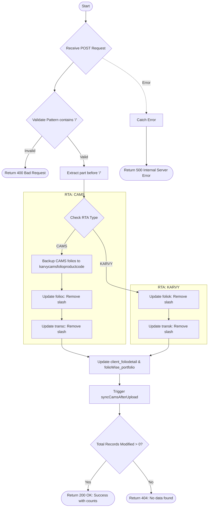

# Remove Slash From Folio
This API is used to clean up folio numbers by removing the characters following a forward slash (`/`). It updates the folio numbers across multiple collections including folios, transactions, and portfolios for a specific RTA and AMC.

### User flow diagram


### Method
```
POST
```

### Route
```
/remove-slash-from-folio
```

### Authorization
```
Bearer <token>
```

### Request Body
```json
{
    "rta": "CAMS",
    "amc": "HDFC Mutual Fund",
    "action": "Cleanup",
    "pattern": "12345/678"
}
```

### Parameters
| Name | Type | Description |
|------|------|-------------|
| rta | String | The registrar (e.g., "CAMS", "KARVY"). |
| amc | String | The AMC name/pattern to filter records. |
| action | String | Optional action description. |
| pattern | String | The folio pattern containing the slash to be removed. |

### Response `Status: (200)`
```json
{
    "status": true,
    "message": "Success - 15 records updated"
}
```

### Response `Status: (400)`
```json
{
    "status": false,
    "message": "Folio number does not contain '/', nothing to remove"
}
```

### Response `Status: (404)`
```json
{
    "status": false,
    "message": "No data found for update"
}
```

### Response `Status: (500)`
```json
{
    "status": false,
    "message": "Internal Server Error"
}
```
