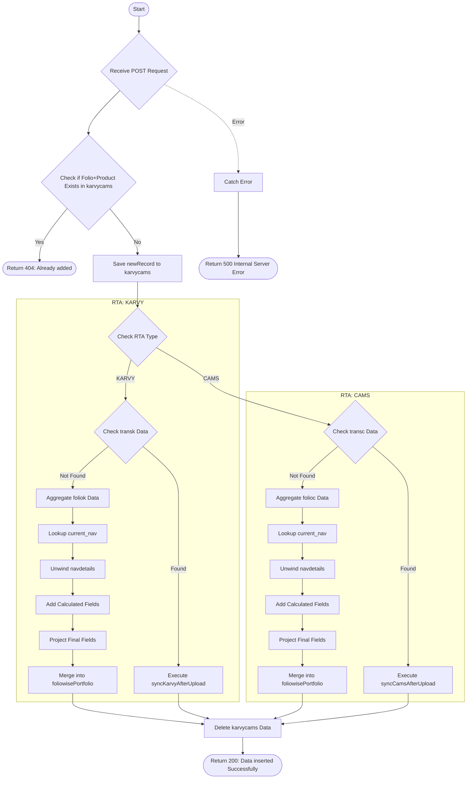

# Sync Single Scheme
Syncs a single scheme's details into the system. It handles data for both CAMS and KARVY registrars, checks for duplicates, and performs necessary aggregations and data merging into the portfolio.

### User flow diagram


### Method
```
POST
```

### Route
```
/sync-single-scheme
```

### Authorization
```
Bearer <token>
```

### Request Body
```json
{
    "folio": "1234567/89",
    "productcode": "P001",
    "RTA": "CAMS", 
    "name": "John Doe",
    "gpan": "",
    "pan": "ABCDE1234F",
    "ACCORD_STATUS": "Active",
    "ACCORD_SCHEMECODE": "SCH001",
    "jointpan1": "",
    "jointpan2": ""
}
```

### Parameters
| Name | Type | Description |
|------|------|-------------|
| folio | String | The folio number of the scheme. |
| productcode | String | The product code of the scheme. |
| RTA | String | The registrar (e.g., "CAMS", "KARVY"). |
| name | String | Name of the investor. |
| gpan | String | Guardian PAN (if applicable). |
| pan | String | Primary PAN of the investor. |
| ACCORD_STATUS | String | Status of the scheme in Accord. |
| ACCORD_SCHEMECODE | String | Scheme code in Accord. |
| jointpan1 | String | First joint holder's PAN. |
| jointpan2 | String | Second joint holder's PAN. |

### Response `Status: (200)`
```json
{
    "status": true,
    "message": "Data inserted Successfully"
}
```

### Response `Status: (404)`
```json
{
    "status": false,
    "message": "Already added"
}
```

### Response `Status: (500)`
```json
{
    "status": false,
    "message": "Internal Server Error"
}
```
