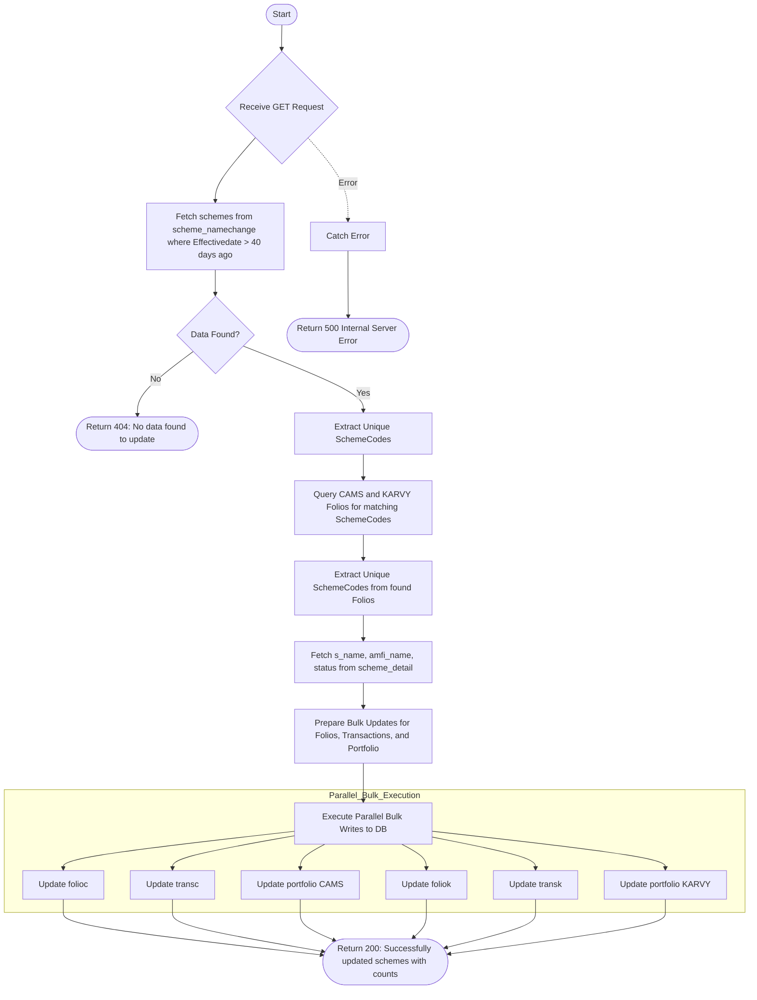

# Update Scheme Name
Updates scheme names and statuses across folios, transactions, and portfolios based on recent changes recorded in the `scheme_namechange` collection (data from the last 40 days).

### User flow diagram


### Method
```
GET
```

### Route
```
/update-cams-schemename
```

### Authorization
```
Bearer <token>
```

### Sample Request
```http
GET: https://<host>/update-cams-schemename
```

### Response `Status: (200)`
```json
{
    "success": true,
    "message": "Successfully updated schemes",
    "foliocModified": 5,
    "transcModified": 10,
    "portfoliocModified": 5,
    "foliokModified": 2,
    "transkModified": 4,
    "portfoliokModified": 2
}
```

### Response `Status: (404)`
```json
{
    "status": false,
    "message": "No data found to update"
}
```

### Response `Status: (500)`
```json
{
    "status": false,
    "message": "Internal Server Error"
}
```
