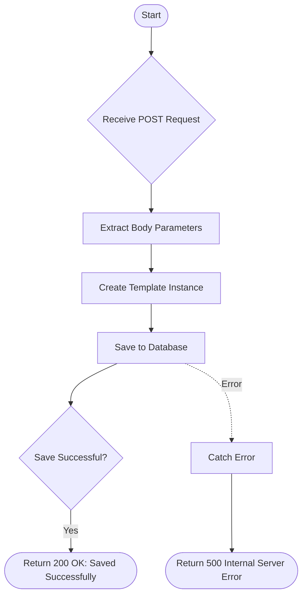

# Create Template
Creates a new email template with a customized name, category, and content.

### User flow diagram


### Method
```
POST
```

### Route
```
/create-template
```

### Authorization
```
None
```

### Request Body
```json
{
    "name": "Template Name",
    "category": "Newsletter",
    "content": "<h1>Hello World</h1><p>This is the email content.</p>"
}
```

### Response `Status: (200)`
```json
{
    "status": true,
    "message": "Saved Successfully."
}
```

### Response `Status: (500)`
```json
{
    "status": false,
    "message": "Internal Server Error"
}
```
