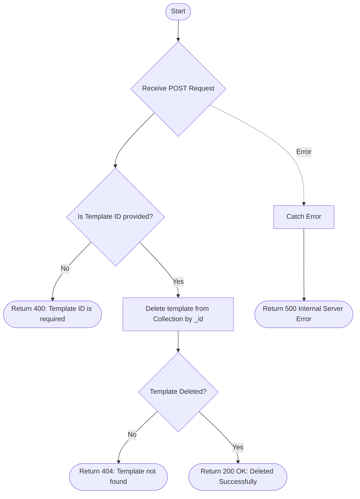

# Delete Template
Deletes a specific email template from the system using its unique database ID (`_id`).

### User flow diagram


### Method
```
POST
```

### Route
```
/delete-template
```

### Authorization
```
Bearer <token>
```

### Request Body
```json
{
    "id": "60d5ec9f1a2b3c4d5e6f7a8b"
}
```

### Parameters
| Name | Type | Description |
|------|------|-------------|
| id | String | The unique database ID (`_id`) of the template to delete. |

### Response `Status: (200)`
```json
{
    "status": true,
    "message": "Deleted Successfully"
}
```

### Response `Status: (400)`
```json
{
    "status": false,
    "message": "Template ID is required"
}
```

### Response `Status: (404)`
```json
{
    "status": false,
    "message": "Template not found"
}
```

### Response `Status: (500)`
```json
{
    "status": false,
    "message": "Internal Server Error"
}
```
