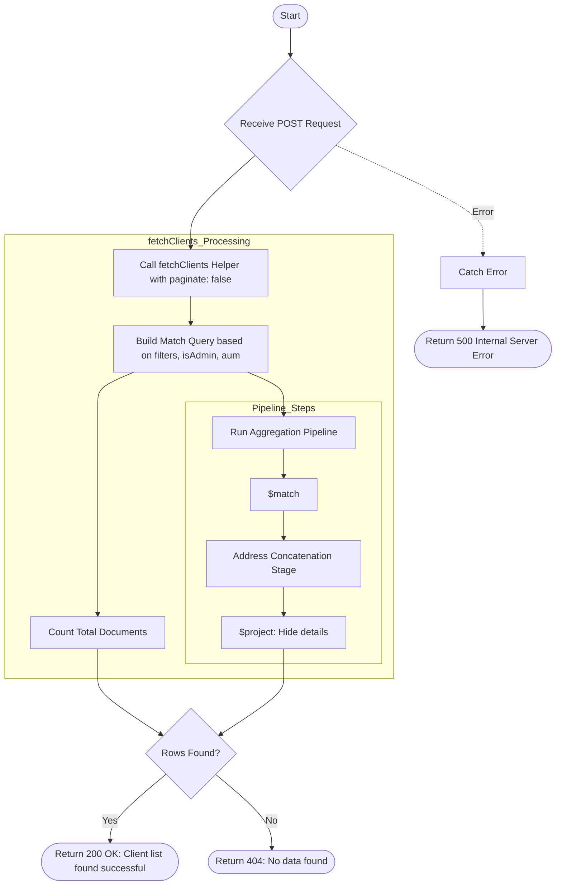

# Filter Client List
This API retrieves a complete (non-paginated) list of clients based on provided filters. It is designed for scenarios where the full set of matching clients is needed at once, such as for mass operations or exports within the email scheduler.

### User flow diagram


### Method
```
POST
```

### Route
```
/filter-client-list
```

### Authorization
```
Bearer <token>
```

### Request Body
```json
{
    "filters": {
        "city": "Mumbai",
        "category": "High Net Worth"
    },
    "isAdmin": true,
    "aum": "equity"
}
```

### Parameters
| Name | Type | Description |
|------|------|-------------|
| filters | Object | **Optional.** Key-value pairs for filtering client data. |
| isAdmin | Boolean | **Optional.** Flag to indicate if the requesting user is an admin for query scoping. |
| aum | String | **Optional.** Criteria for AUM-based filtering. |

### Response `Status: (200)`
```json
{
    "status": true,
    "message": "Client list found successful",
    "payload": {
        "length": 5,
        "total": 5,
        "clientList": [
            {
                "_id": "60d5ec9f1a2b3c4d5e6f7a8b",
                "name": "Jane Smith",
                "email": "jane.smith@example.com",
                "mobile": "9988776655",
                "address": "456 Avenue, Mumbai, 400001",
                "status": "Active"
            }
        ]
    }
}
```

### Response `Status: (404)`
```json
{
    "status": false,
    "message": "No data found"
}
```

### Response `Status: (500)`
```json
{
    "status": false,
    "message": "Internal Server Error"
}
```
