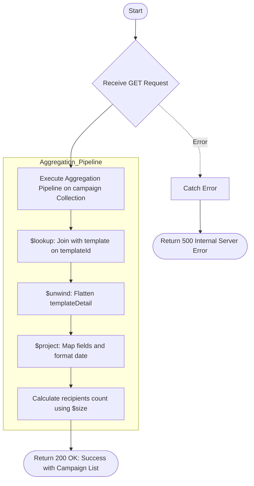

# List Campaign
Retrieves a list of all email campaigns, joined with their corresponding template details. It provides an overview of campaign settings, template purposes, and the total number of recipients for each campaign.

### User flow diagram


### Method
```
GET
```

### Route
```
/list-campaign
```

### Authorization
```
Bearer <token>
```

### Sample Request
```http
GET: https://<host>/list-campaign
```

### Response `Status: (200)`
```json
{
    "status": true,
    "message": "Success",
    "payload": {
        "length": 1,
        "campaignList": [
            {
                "_id": "60d5ec9f1a2b3c4d5e6f7a8b",
                "campaignName": "Year End Special",
                "frequency": "Monthly",
                "templateName": "Yearly Portfolio Summary",
                "templatePurpose": "Reports",
                "campaignSubject": "Your 2025 Portfolio Update",
                "templateId": "TEMP001",
                "recipients": 150,
                "time": "10:00",
                "createdDate": "22-12-2025"
            }
        ]
    }
}
```

### Response `Status: (500)`
```json
{
    "status": false,
    "message": "Internal Server Error"
}
```
