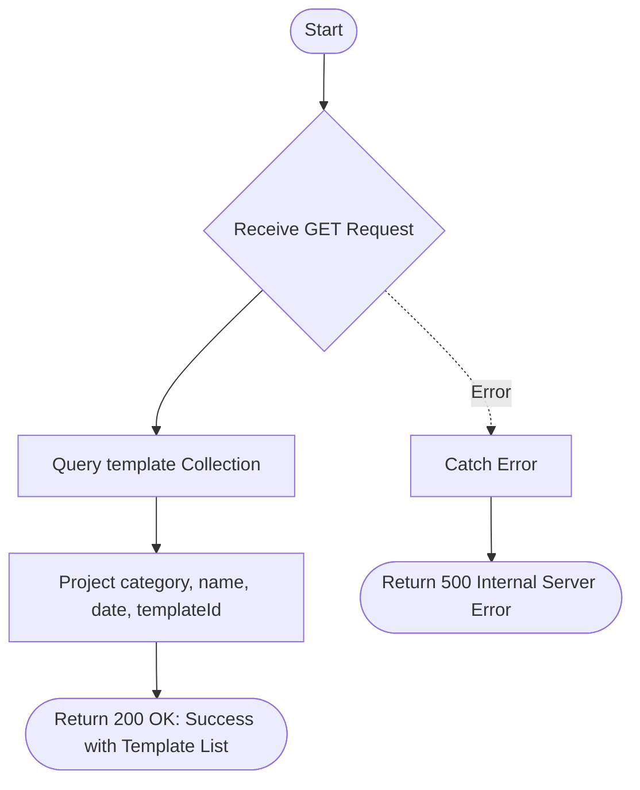

# List Template
Retrieves a list of all email templates stored in the system, including their category, name, creation date, and unique template ID.

### User flow diagram


### Method
```
GET
```

### Route
```
/list-template
```

### Authorization
```
Bearer <token>
```

### Sample Request
```http
GET: https://<host>/list-template
```

### Response `Status: (200)`
```json
{
    "status": true,
    "message": "Success",
    "payload": {
        "length": 2,
        "templateList": [
            {
                "_id": "60d5ec9f1a2b3c4d5e6f7a8b",
                "category": "Portfolio",
                "name": "Quarterly Statement",
                "date": "2025-12-22",
                "templateId": "TEMP001"
            },
            {
                "_id": "60d5ec9f1a2b3c4d5e6f7a8c",
                "category": "Welcome",
                "name": "Client Onboarding",
                "date": "2025-12-21",
                "templateId": "TEMP002"
            }
        ]
    }
}
```

### Response `Status: (500)`
```json
{
    "status": false,
    "message": "Internal Server Error"
}
```
