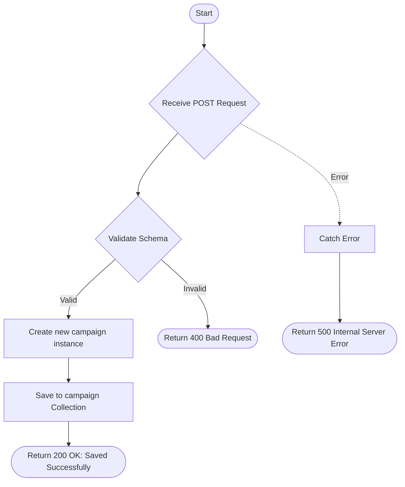

# Save Campaign
This API is used to create and save a new email campaign. it stores details like the template to use, target email list, campaign name, subject, and scheduling frequency settings.

### User flow diagram


### Method
```
POST
```

### Route
```
/save-campaign
```

### Authorization
```
Bearer <token>
```

### Request Body
```json
{
    "templateId": "60d5ec9f1a2b3c4d5e6f7a8b",
    "emailList": ["client1@example.com", "client2@example.com"],
    "campaignType": "Promotional",
    "campaignName": "Year End Special",
    "campaignSubject": "Merry Christmas and Happy New Year!",
    "frequency": "Monthly",
    "frequencyResult": "25th",
    "time": "10:00"
}
```

### Parameters
| Name | Type | Description |
|------|------|-------------|
| templateId | String | The unique ID of the template to be used for this campaign. |
| emailList | Array | List of recipient email addresses. |
| campaignType | String | The type of campaign (e.g., "Monthly", "Yearly", "Promotional"). |
| campaignName | String | Descriptive name for the campaign. |
| campaignSubject | String | The subject line for the campaign emails. |
| frequency | String | How often the campaign should run (e.g., "Daily", "Weekly", "Monthly"). |
| frequencyResult | String | Specific day/date detail based on the frequency (e.g., "Monday", "1st"). |
| time | String | The time of day to trigger the campaign. |

### Response `Status: (200)`
```json
{
    "status": true,
    "message": "Saved Successfully."
}
```

### Response `Status: (500)`
```json
{
    "status": false,
    "message": "Internal Server Error"
}
```
