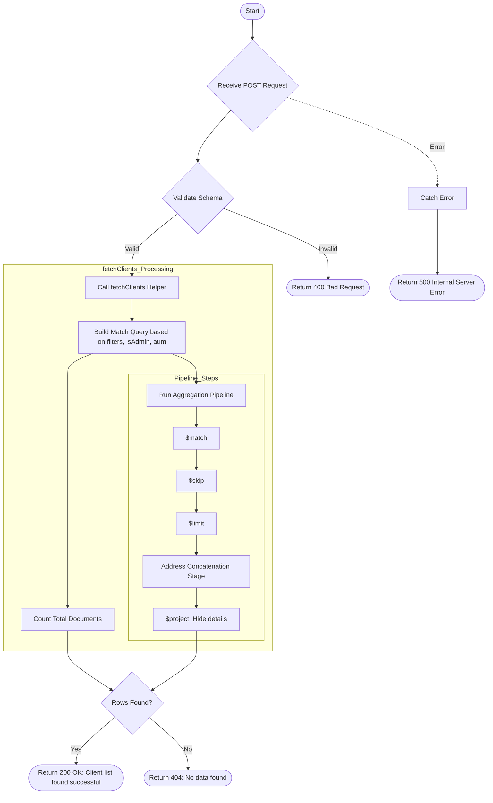

# Scheduler Client List
This API retrieves a paginated list of clients for the email scheduler. It supports filtering by various criteria and handles authorization checks (admin vs. non-admin) and AUM-based filtering.

### User flow diagram


### Method
```
POST
```

### Route
```
/scheduler-client-list
```

### Authorization
```
Bearer <token>
```

### Request Body
```json
{
    "page": 1,
    "limit": 10,
    "filters": {
        "status": "Active"
    },
    "isAdmin": true,
    "aum": "equity"
}
```

### Parameters
| Name | Type | Description |
|------|------|-------------|
| page | Number | **Optional.** Current page number (default: 1). |
| limit | Number | **Optional.** Number of records per page (default: 10). |
| filters | Object | **Optional.** Key-value pairs for filtering client data. |
| isAdmin | Boolean | **Optional.** Flag to indicate if the requesting user is an admin. |
| aum | String | **Optional.** Criteria for AUM-based filtering. |

### Response `Status: (200)`
```json
{
    "status": true,
    "message": "Client list found successful",
    "payload": {
        "length": 1,
        "total": 50,
        "clientList": [
            {
                "_id": "60d5ec9f1a2b3c4d5e6f7a8b",
                "name": "John Doe",
                "email": "john.doe@example.com",
                "mobile": "9876543210",
                "address": "Street Name, City, PIN",
                "status": "Active"
            }
        ]
    }
}
```

### Response `Status: (404)`
```json
{
    "status": false,
    "message": "No data found"
}
```

### Response `Status: (500)`
```json
{
    "status": false,
    "message": "Internal Server Error"
}
```
