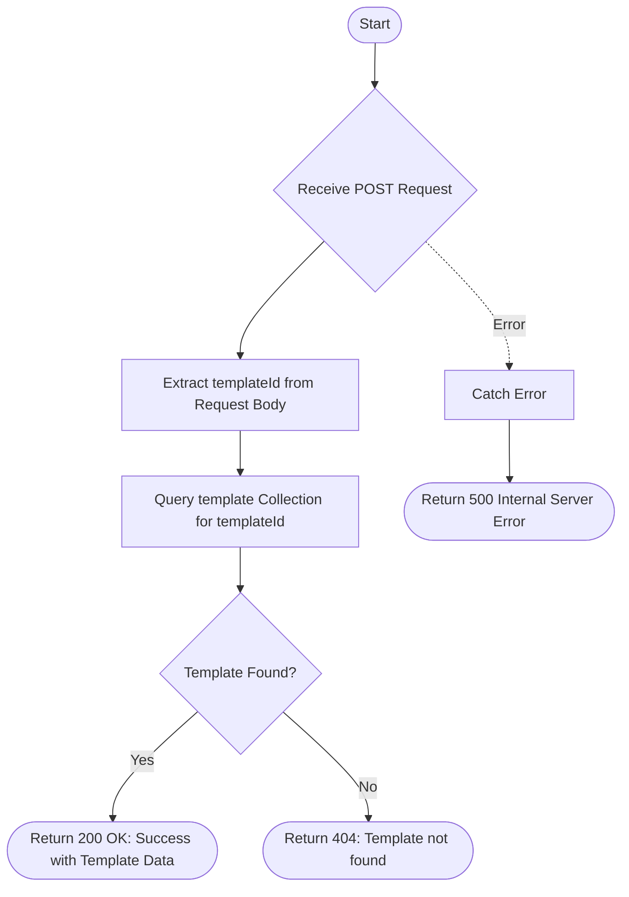

# Show Template
Retrieves the details of a specific email template based on the provided template ID.

### User flow diagram


### Method
```
POST
```

### Route
```
/show-template
```

### Authorization
```
Bearer <token>
```

### Request Body
```json
{
    "templateId": "TEMP123"
}
```

### Response `Status: (200)`
```json
{
    "status": true,
    "message": "Success",
    "payload": {
        "templateData": {
            "_id": "60d5ec9f1a2b3c4d5e6f7a8b",
            "templateId": "TEMP123",
            "name": "Welcome Email",
            "subject": "Welcome to WMS",
            "body": "<h1>Welcome</h1><p>Glad to have you on board!</p>",
            "createdAt": "2025-12-22T10:00:00Z"
        }
    }
}
```

### Response `Status: (404)`
```json
{
    "status": false,
    "message": "Template not found"
}
```

### Response `Status: (500)`
```json
{
    "status": false,
    "message": "Internal Server Error"
}
```
