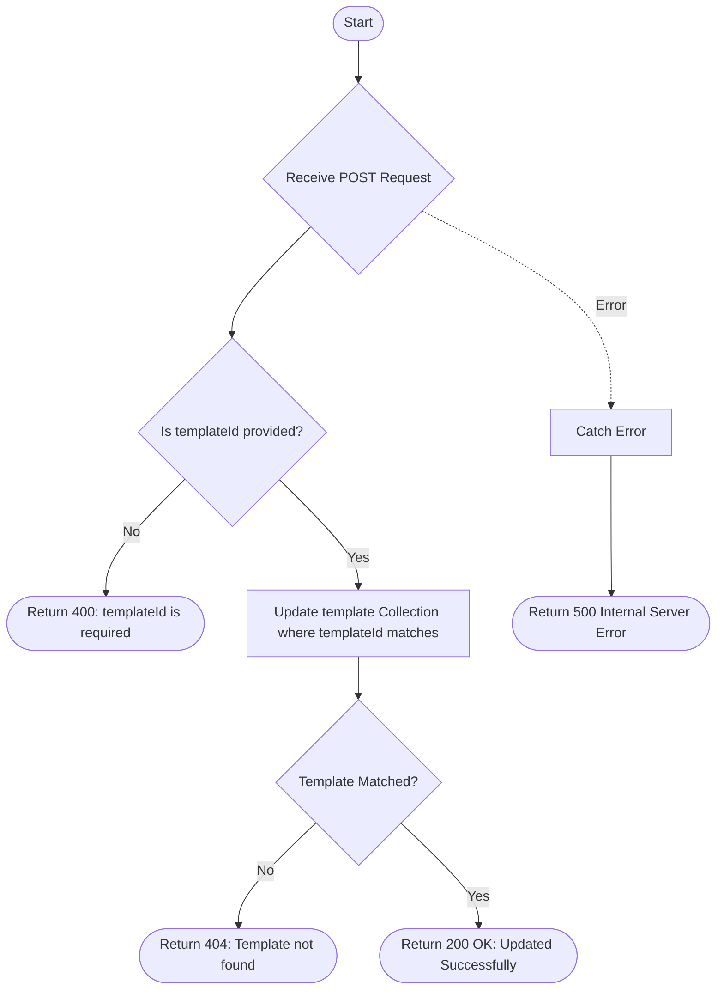

# Update Template
Updates the details of an existing email template, including its name, category, and content, using the provided template ID.

### User flow diagram


### Method
```
POST
```

### Route
```
/update-template
```

### Authorization
```
Bearer <token>
```

### Request Body
```json
{
    "templateId": "TEMP001",
    "name": "Updated Quarterly Statement",
    "category": "Reports",
    "content": "<h1>Your Updated Statement</h1><p>Here is your quarterly portfolio summary...</p>"
}
```

### Parameters
| Name | Type | Description |
|------|------|-------------|
| templateId | String | **Required.** The unique identifier of the template to be updated. |
| name | String | The new name of the template. |
| category | String | The new category of the template. |
| content | String | The updated content/body of the email template. |

### Response `Status: (200)`
```json
{
    "status": true,
    "message": "Updated Successfully"
}
```

### Response `Status: (400)`
```json
{
    "status": false,
    "message": "templateId is required"
}
```

### Response `Status: (404)`
```json
{
    "status": false,
    "message": "Template not found"
}
```

### Response `Status: (500)`
```json
{
    "status": false,
    "message": "Internal Server Error"
}
```
