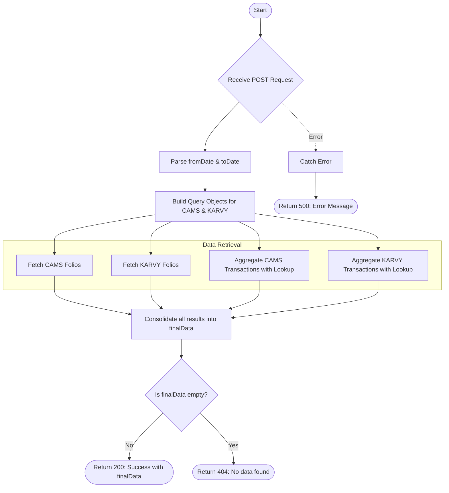

# Client Mapping
Searches and aggregates client data across multiple RTA sources (CAMS and KARVY). The API retrieves records from both primary folio collections and transaction collections, utilizing date ranges and aggregation pipelines to provide a comprehensive view of client holdings and history.

### User flow diagram


### Method
```
POST
```

### Route
```
/client-mapping
```

### Authorization
```
Bearer <token>
```

### Request Body
```json
{
    "name": "John Doe",
    "pan": "ABCDE1234F",
    "fromDate": "01-01-2023",
    "toDate": "31-12-2023"
}
```

**Field Details:**
- `name` (String, Optional): Client name for searching.
- `pan` (String, Optional): PAN number for searching.
- `fromDate` / `toDate` (String, Optional): Date range for filtering transactions and folio updates.

### Response `Status: (200)`
```json
{
    "success": true,
    "msg": "Success",
    "data": {
        "length": 2,
        "finalData": [
            {
                "_id": "658123abc...",
                "NAME": "JOHN DOE",
                "PAN": "ABCDE1234F",
                "FOLIO": "12345678",
                "PRODUCT": "PROD001",
                "DATE": "2023-05-15T00:00:00Z",
                "ADDRESS1": "123 Main St",
                "ADDRESS2": "",
                "ADDRESS3": "",
                "RTA": "CAMS"
            }
        ]
    }
}
```

### Response `Status: (404)`
```json
{
    "success": false,
    "message": "No data found"
}
```

### Response `Status: (500)`
```json
{
    "success": false,
    "message": "Error details..."
}
```

## Logic Overview

The API aggregates data from four distinct sources:

### 1. Source Data Fetching
- **CAMS Folios (`folioc`)**: Direct find mapping fields like `INV_NAME` to `NAME`, `PAN_NO` to `PAN`.
- **KARVY Folios (`foliok`)**: Direct find mapping fields like `INVNAME` to `NAME`, `PANGNO` to `PAN`.

### 2. Transaction Aggregation
For transaction sources (`trans_cams` and `trans_karvy`), the API uses aggregation pipelines to:
- **Group**: Groups by name and PAN to capture unique client-product combinations.
- **Lookup**: Performs a `$lookup` against the corresponding folio collection (CAMS or KARVY) to retrieve missing metadata like address and folio date.
- **Normalize**: Sets default empty strings for missing address fields and resolves the date from the matched folio record.

### 3. Consolidation
The results from all four queries are spread into a single array (`finalData`) and returned to the client.
