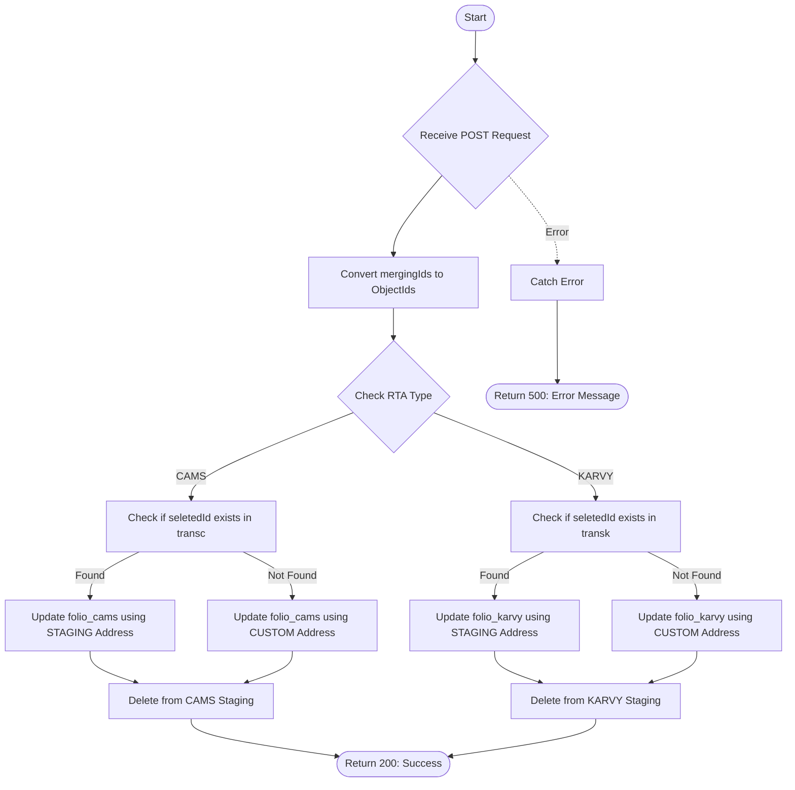

# Folio Merge
Handles the migration of folio records from temporary upload schemas (`folioCAMSNewSchema` or `folioKARVYNewSchema`) to the main production collections (`folio_cams` or `folio_karvy`). This API includes specific logic to determine whether to use existing record addresses or apply new user-provided addresses based on the existence of associated transactions.

### User flow diagram


### Method
```
POST
```

### Route
```
/folio-merge-client
```

### Authorization
```
Bearer <token>
```

### Request Body
```json
{
    "seletedId": "658123abc...",
    "mergingIds": ["658123abc...", "658456def..."],
    "name": "Jane Doe",
    "pan": "ABCDE1234F",
    "add1": "123 New Street",
    "add2": "Building 5",
    "add3": "Industrial Area",
    "rta": "CAMS"
}
```

**Field Details:**
- `seletedId` (String): ID of the reference transaction used to determine address preference.
- `mergingIds` (Array): List of IDs from the temporary schemas to be merged.
- `name` / `pan`: Identity fields (normalized to uppercase).
- `add1` / `add2` / `add3`: Custom address fields (used if no transaction is found for `seletedId`).
- `rta`: Either "CAMS" or "KARVY".

### Response `Status: (200)`
```json
{
    "success": true,
    "msg": "Success",
    "matchedfoliocams": [] 
}
```

### Response `Status: (500)`
```json
{
    "success": false,
    "message": "Error details..."
}
```

## Logic Overview

The API implements a conditional merge strategy based on data availability in the primary transaction tables.

### 1. Transaction Check
The API first checks if the `seletedId` exists in the permanent transaction table (`transc` or `transk`). This presence determines the address source for the merge.

### 2. Conditional Address Selection
- **If Transaction Exists**: The API assumes the existing staging record's address is valid. It converts the existing staging address fields to uppercase during the projection.
- **If Transaction NOT Found**: The API uses the `name`, `pan`, `add1`, `add2`, and `add3` provided in the request body to overwrite the identity and contact information.

### 3. Data Normalization
Throughout the pipelines, several fields are normalized:
- **Case**: Name, PAN, and Address fields are converted to uppercase (`$toUpper`).
- **Email**: KARVY email addresses are converted to lowercase (`$toLower`).

### 4. Record Migration & Cleanup
- **Merge**: Records are projected and merged into the production collections (`folio_cams` or `folio_karvy`) using `whenMatched: 'replace'`.
- **Delete**: Once successfully merged, the records are permanently removed from the temporary upload schemas to prevent duplication.
