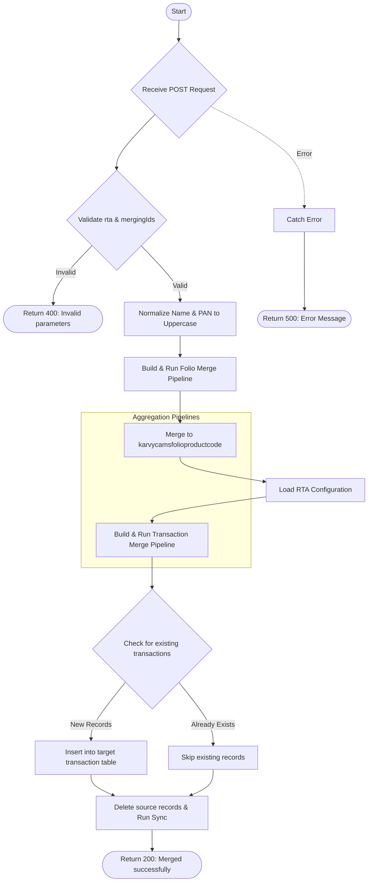

# Folio Trans Merge Client
Merges client folios and transactions from source schemas (`transCAMSNewSchema` or `transKARVYNewSchema`) into centralized product mapping and permanent transaction tables. This API handles data normalization, duplicate prevention via `$lookup`, and record cleanup.

### User flow diagram


### Method
```
POST
```

### Route
```
/folio-trans-merge-client
```

### Authorization
```
Bearer <token>
```

### Request Body
```json
{
    "selectedId": "658123abc...",
    "mergingIds": ["658123abc...", "658456def..."],
    "name": "JOHN DOE",
    "pan": "ABCDE1234F",
    "rta": "CAMS",
    "userid": "123",
    "jointpan1": "FGHIJ5678K",
    "jointpan2": ""
}
```

**Field Details:**
- `selectedId` (String): ID of the primary record (reserved for UI context, not used in logic).
- `mergingIds` (Array): List of source transaction IDs to be merged.
- `name` (String): Normalized name to apply to merged records.
- `pan` (String): Normalized PAN to apply to merged records.
- `rta` (String): Either "CAMS" or "KARVY".
- `userid` (String/Number): ID of the user performing the operation.
- `jointpan1` / `jointpan2` (String, Optional): Joint-holder PANs.

### Response `Status: (200)`
```json
{
    "success": true,
    "msg": "CAMS Merged successfully"
}
```

### Response `Status: (400)`
```json
{
    "success": false,
    "message": "Invalid request parameters"
}
```

### Response `Status: (500)`
```json
{
    "success": false,
    "message": "Error details..."
}
```

## Logic Overview

The API performs a two-stage merge process:

### 1. Folio Mapping Merge
Updates or inserts into `karvycamsfolioproductcode` to map the specific folio and product code to the provided name and PAN.
- **Fields mapped**: `folio`, `productcode`, `RTA`, `name`, `pan`, `jh1_pan`, `jh2_pan`.
- **Strategy**: Replace if matched on `folio`, `productcode`, and `RTA`.

### 2. Transaction Merge
Moves transactions from the temporary upload schema (`trans_cams_new` or `trans_karvy_new`) to the main transaction tables (`trans_cams` or `trans_karvy`).
- **Duplicate Prevention**: Uses an aggregation pipeline with `$lookup` against the target table.
- **Comparison Fields**:
    - **CAMS**: `FOLIO_NO`, `PRODCODE`, `TRXNNO`, `NATURE`, `PURPRICE`.
    - **KARVY**: `TD_ACNO`, `FMCODE`, `TD_TRNO`, `NATURE`, `TRFLAG`, `TD_UNITS`.
- **Transformation**: Adds `userid`, `USER_ID`, and `ENTRY_DATE` while preserving source fields.

### 3. Cleanup & Synchronization
Once merging is complete, the source records are deleted from the temporary storage, and an RTA-specific synchronization function (`syncCamsAfterUpload` or `syncKarvyAfterUpload`) is triggered to update dependent calculations or caches.
