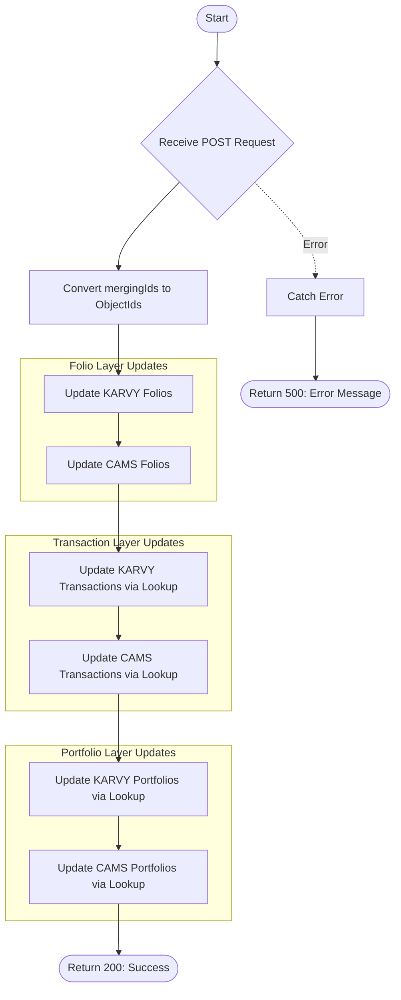

# Merge Client
Performs a comprehensive metadata update for client records across multiple database layers. This API propagates changes to Name, PAN, and Address information into folio collections, transaction history, and portfolio summaries for both CAMS and KARVY RTAs simultaneously.

### User flow diagram


### Method
```
POST
```

### Route
```
/merge-client
```

### Authorization
```
Bearer <token>
```

### Request Body
```json
{
    "seletedId": "658123abc...",
    "mergingIds": ["658123abc...", "658456def..."],
    "name": "Jane Doe",
    "pan": "ABCDE1234F",
    "add1": "123 New Street",
    "add2": "Building 5",
    "add3": "Industrial Area"
}
```

**Field Details:**
- `seletedId` (String): The primary record ID (typically stored for context).
- `mergingIds` (Array): List of IDs for files/records to be updated.
- `name` / `pan` (String): Updated identity information (will be converted to uppercase).
- `add1` / `add2` / `add3` (String): Updated address components (will be converted to uppercase).

### Response `Status: (200)`
```json
{
    "success": true,
    "msg": "Success"
}
```

### Response `Status: (500)`
```json
{
    "success": false,
    "message": "Error details..."
}
```

## Logic Overview

The API executes six major aggregation pipelines in sequence. Each pipeline uses `allowDiskUse(true)` for handling large datasets and `$merge` for efficient updates.

### 1. Folio Updates
- **KARVY (`foliok`)** & **CAMS (`folioc`)**: Matches by `_id`. Updates primary fields like `INVNAME`/`INV_NAME`, `PAN_NO`/`PANGNO`, and address lines. Operates on `whenMatched: 'replace'`.

### 2. Transaction Updates
Updates transactions in `trans_karvy` and `trans_cams` by finding records that match the folio/product combinations of the target IDs.
- **Lookup**: Joins the folio collection with the transaction collection on `ACNO`/`PRCODE` (KARVY) or `FOLIOCHK`/`PRODUCT` (CAMS).
- **Projection**: Preserves all original transaction fields while overriding `INVNAME`/`INV_NAME` and `PAN`/`PAN1`.

### 3. Portfolio Updates
Updates summarized data in `foliowisePortfolio`.
- **Lookup**: Joins the source collection with `foliowisePortfolio` on folio and product code.
- **Data Preservation**: Maps and keeps all complex financial calculation fields (cagr, absolute, units, etc.) while updating identity fields.

### Strategy
- **Case Normalization**: All incoming strings (name, pan, address) are converted to uppercase using `$toUpper` within the aggregation pipelines.
- **Data Integrity**: Uses `$merge` with `on: '_id'` specifically to target records identified during the lookup stage, ensuring only relevant transactions and portfolio entries are modified.
