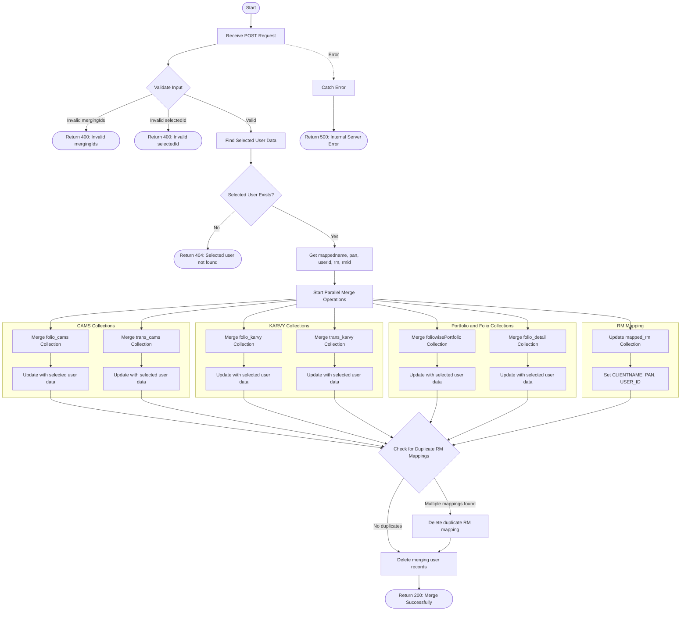

# Merge Client Via UserID
Merges multiple client records into a single selected client record based on user IDs. This operation consolidates data across multiple collections including folios (CAMS and KARVY), transactions (CAMS and KARVY), portfolio data, folio details, and RM mappings. The selected client's information (name, PAN, RM details) is applied to all merged records, and the merging client records are deleted from the user master.

### User flow diagram


### Method
```
POST
```

### Route
```
/merge-via-userid
```

### Authorization
```
Bearer <token>
```

### Request Body
```json
{
    "seletedId": 12345,
    "mergingIds": [67890, 11111, 22222]
}
```

### Parameters
| Name | Type | Description |
|------|------|-------------|
| seletedId | Number | The user ID of the selected client whose data will be retained and applied to merged records. |
| mergingIds | Array<Number> | Array of user IDs to be merged into the selected client. These records will be deleted after merge. |

### Response `Status: (200)`
```json
{
    "status": true,
    "message": "Merge Successfully"
}
```

### Response `Status: (400)`
```json
{
    "status": false,
    "message": "Invalid mergingIds"
}
```

```json
{
    "status": false,
    "message": "Invalid selectedId"
}
```

### Response `Status: (404)`
```json
{
    "status": false,
    "message": "Selected user not found"
}
```

### Response `Status: (500)`
```json
{
    "status": false,
    "message": "Error message details"
}
```

## Merge Operations Details

### Collections Updated
1. **folio_cams** - CAMS folio records
   - Match criteria: `FOLIOCHK`, `PRODUCT`
   - Updates: `INV_NAME`, `PAN_NO`, `USER_ID`, `userid`, `RMID`, `RM`, `MERGE_DATE`

2. **folio_karvy** - KARVY folio records
   - Match criteria: `ACNO`, `PRCODE`
   - Updates: `INVNAME`, `PANGNO`, `USER_ID`, `userid`, `RMID`, `RM`, `MERGE_DATE`

3. **trans_cams** - CAMS transaction records
   - Match criteria: `FOLIO_NO`, `PRODCODE`, `TRXNNO`, `NATURE`, `PURPRICE`
   - Updates: `INV_NAME`, `PAN`, `USER_ID`, `userid`, `RMID`, `RM`, `MERGE_DATE`

4. **trans_karvy** - KARVY transaction records
   - Match criteria: `TD_ACNO`, `FMCODE`, `TD_TRNO`, `NATURE`, `TRFLAG`, `TD_UNITS`
   - Updates: `INVNAME`, `PAN1`, `USER_ID`, `userid`, `RMID`, `RM`, `MERGE_DATE`

5. **foliowisePortfolio** - Portfolio data by folio
   - Match criteria: `folio`, `productcode`
   - Updates: `name`, `pan`, `USER_ID`, `userid`, `RMID`, `RM`, `MERGE_DATE`

6. **folio_detail** - Folio detail records
   - Match criteria: `folio`, `product`
   - Updates: `mappedname`, `userid`, `MERGE_DATE`

7. **mapped_rm** - RM mapping records
   - Updates all records with merging user IDs
   - Sets: `CLIENTNAME`, `PAN`, `USER_ID`, `MERGE_DATE`
   - Removes duplicates if multiple mappings exist for selected user

8. **new_usermaster** - User master records
   - Deletes all records with user IDs in `mergingIds` array

### Merge Strategy
- **whenMatched**: `replace` - Existing records are replaced with updated data
- **whenNotMatched**: `discard` - No new records are inserted, only existing records are updated
- All merge operations add a `MERGE_DATE` timestamp field with the current date/time
