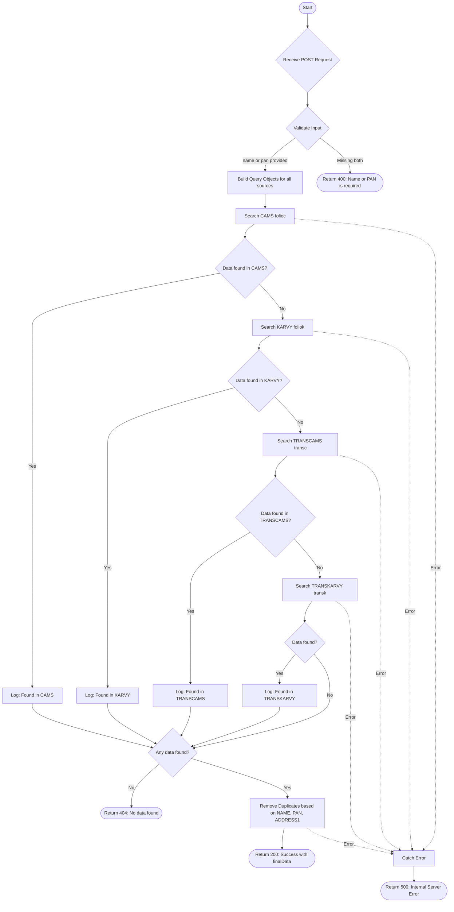

# Search Client
Searches for client information across multiple data sources (CAMS, KARVY, TRANSCAMS, TRANSKARVY) based on name or PAN number. The API implements a cascading search strategy, checking each source sequentially until data is found, and returns deduplicated results.

### User flow diagram


### Method
```
POST
```

### Route
```
/search-client
```

### Authorization
```
Bearer <token>
```

### Request Body
```json
{
    "name": "John Doe",
    "pan": "ABCDE1234F"
}
```

**Note:** At least one of `name` or `pan` must be provided.

**Field Details:**
- `name` (String, Optional): Client name - supports partial match, case-insensitive
- `pan` (String, Optional): PAN number - exact match

### Response `Status: (200)`
```json
{
    "success": true,
    "msg": "Success",
    "length": 2,
    "finalData": [
        {
            "NAME": "John Doe",
            "PAN": "ABCDE1234F",
            "ADDRESS1": "123 Main Street",
            "ADDRESS2": "Apartment 4B",
            "ADDRESS3": "Downtown",
            "CITY": "Mumbai",
            "STATE": "Maharashtra",
            "PINCODE": "400001"
        },
        {
            "NAME": "John Doe",
            "PAN": "ABCDE1234F",
            "ADDRESS1": "456 Park Avenue",
            "ADDRESS2": "",
            "ADDRESS3": "",
            "CITY": "Delhi",
            "STATE": "Delhi",
            "PINCODE": "110001"
        }
    ]
}
```

### Response `Status: (400)`
```json
{
    "success": false,
    "message": "Name or PAN is required"
}
```

### Response `Status: (404)`
```json
{
    "success": false,
    "message": "No data found"
}
```

### Response `Status: (500)`
```json
{
    "success": false,
    "message": "Error message details"
}
```

## Data Sources

The API searches the following collections in cascading order:

1. **CAMS** (`folioc`) - PAN field: `PAN_NO`, Name field: `INV_NAME`
2. **KARVY** (`foliok`) - PAN field: `PANGNO`, Name field: `INVNAME`
3. **TRANSCAMS** (`transc`) - PAN field: `PAN`, Name field: `INV_NAME` (uses aggregation)
4. **TRANSKARVY** (`transk`) - PAN field: `PAN1`, Name field: `INVNAME` (uses aggregation)

## Key Features

- **Cascading Search**: Stops searching once data is found in any source
- **Flexible Search**: Supports search by name (partial, case-insensitive) or PAN (exact match) or both
- **Deduplication**: Removes duplicate entries based on NAME, PAN, and ADDRESS1 combination
- **Field Mapping**: Uses `fieldMaps` to normalize fields across different data sources
