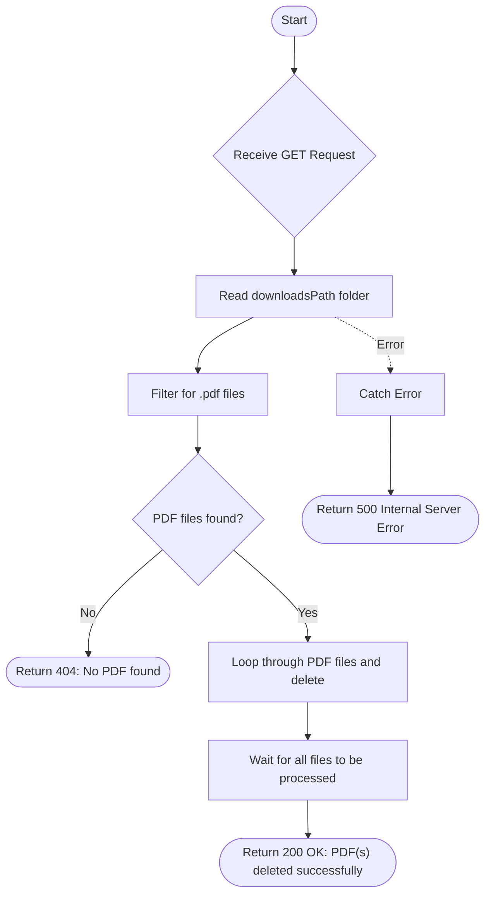

# Delete PDF
This API is used to clear the downloads folder of all generated PDF files. it scans the directory, filters for files with a `.pdf` extension, and deletes them asynchronously.

### User flow diagram


### Method
```
GET
```

### Route
```
/delete-pdf
```

### Authorization
```
Bearer <token>
```

### Sample Request
```http
GET: https://<host>/delete-pdf
```

### Response `Status: (200)`
```json
{
    "status": true,
    "message": "PDF(s) deleted successfully."
}
```

### Response `Status: (404)`
```json
{
    "status": true,
    "message": "No PDF found."
}
```

### Response `Status: (500)`
```json
{
    "status": false,
    "message": "Internal Server Error"
}
```
