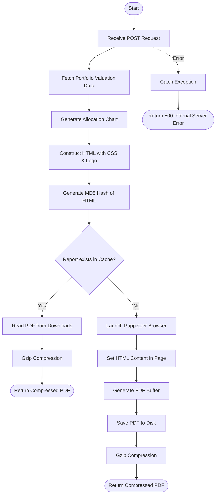

# Portfolio Valuation
This API generates a detailed portfolio valuation report in PDF format. It includes client details, asset allocation charts, and a granular breakdown of mutual fund transactions. The API utilizes Puppeteer for PDF rendering, implements caching based on report content hash, and delivers the final document gzipped.

### User flow diagram


### Method
```
POST
```

### Route
```
/getpdf
```

### Authorization
```
Bearer <token>
```

### Request Body
```json
{
    "name": "John Doe",
    "clientTotal": {
        "mutualFund": 525000.50,
        "equity": 120000.00,
        "total": 645000.50
    },
    "total": {
        "percentages": [45, 25, 30],
        "grandTotal": 645000.50
    },
    "portfolioValue": [
        {
            "category": "Mutual Fund",
            "transactions": [
                {
                    "purchaseDate": "2023-01-15",
                    "type": "SIP",
                    "units": 150.25,
                    "purchaseNav": 45.30,
                    "purchaseValue": 6806.32,
                    "currentValue": 7500.00,
                    "gain": 693.68,
                    "absRet": 10.19,
                    "holdingDays": 365,
                    "cagr": 10.19
                }
            ]
        }
    ]
}
```

### Response `Status: (200)`
```
Content-Type: application/pdf
Content-Encoding: gzip
Content-Disposition: attachment; filename="John Doe-<hash>.pdf"
Access-Control-Expose-Headers: Content-Disposition
```
The response body contains the gzipped binary stream of the generated/cached PDF report.

### Response `Status: (500)`
```json
{
    "status": false,
    "message": "Error message description"
}
```
