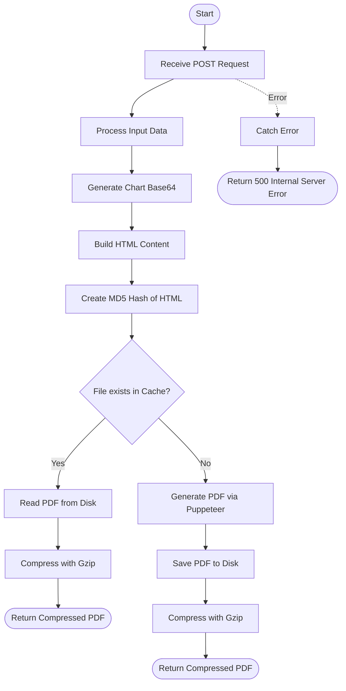

# Portfolio Summary
This API is used to generate a comprehensive portfolio summary PDF. It handles HTML content rendering, chart generation, caching of previously generated PDFs, and gzipped delivery of the final document.

### User flow diagram


### Method
```
POST
```

### Route
```
/getsummary
```

### Authorization
```
Bearer <token>
```

### Request Body
```json
{
    "name": "Client Name",
    "clientTotal": {
        "mutualFund": 100000,
        "equity": 50000,
        "total": 150000
    },
    "total": {
        "percentages": [40, 30, 30],
        "grandTotal": 150000
    }
}
```

### Response `Status: (200)`
```
Content-Type: application/pdf
Content-Encoding: gzip
Content-Disposition: attachment; filename="<client-name>-<hash>.pdf"
```
The response body is a binary stream of the gzipped PDF file.

### Response `Status: (500)`
```json
{
    "status": false,
    "message": "Error message details"
}
```
