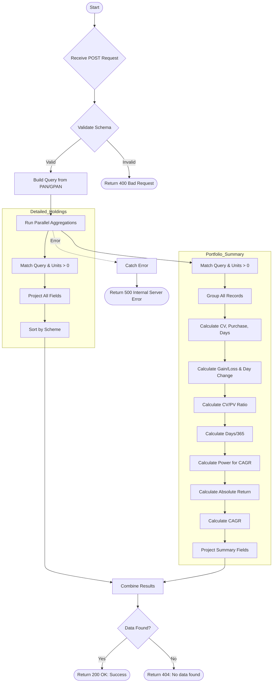

# Get Detailed Portfolio
Retrieves detailed portfolio information for a specific client (by PAN or GPAN and name), including individual scheme holdings and aggregated portfolio metrics with CAGR calculations.

### User flow diagram


### Method
```
POST
```

### Route
```
/get-detailed-portfolio
```

### Authorization
```
Bearer <token>
```

### Request Body
```json
{
    "pan": "ABCDE1234F",
    "gpan": "",
    "name": "Client Name"
}
```

**Note:** Either `pan` or `gpan` should be provided along with `name`.

### Response `Status: (200)`
```json
{
    "status": true,
    "message": "Success",
    "payload": {
        "totalPortfolio": {
            "TotalMarketValue": 125000,
            "Totalpurchase": 100000.50,
            "finalcagr": "12.50",
            "Gainloss": 24500,
            "length": 5,
            "detailedPortfolio": [
                {
                    "folio": "12345/67",
                    "scheme": "Scheme A",
                    "productcode": "P001",
                    "name": "Client Name",
                    "unit": 100.50,
                    "cnav": 150.25,
                    "currentvalue": 15100,
                    "purchase": 12000,
                    "rta": "CAMS",
                    "pan": "ABCDE1234F",
                    "gpan": "ABCDE1234F"
                },
                {
                    "folio": "98765/43",
                    "scheme": "Scheme B",
                    "productcode": "P002",
                    "name": "Client Name",
                    "unit": 50.25,
                    "cnav": 200.50,
                    "currentvalue": 10075,
                    "purchase": 8500,
                    "rta": "KARVY",
                    "pan": "ABCDE1234F",
                    "gpan": "ABCDE1234F"
                }
            ]
        }
    }
}
```

### Response `Status: (404)`
```json
{
    "status": false,
    "message": "No data found"
}
```

### Response `Status: (500)`
```json
{
    "status": false,
    "message": "Internal Server Error"
}
```
