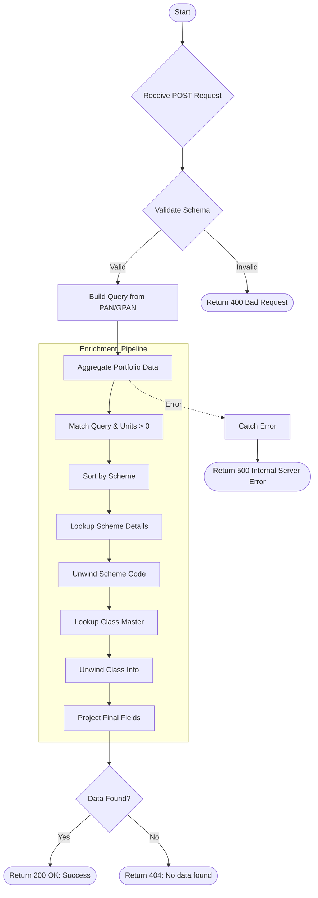

# Get Detailed Portfolio With Category
Retrieves detailed portfolio information for a specific client (by PAN or GPAN and name) with enriched category and asset type information from scheme classifications.

### User flow diagram


### Method
```
POST
```

### Route
```
/get-detailed-portfolio-with-category
```

### Authorization
```
Bearer <token>
```

### Request Body
```json
{
    "pan": "ABCDE1234F",
    "gpan": "",
    "name": "Client Name"
}
```

**Note:** Either `pan` or `gpan` should be provided along with `name`.

### Response `Status: (200)`
```json
{
    "status": true,
    "message": "Success",
    "payload": {
        "length": 3,
        "detailedPortfolio": [
            {
                "scheme": "Scheme A",
                "ACCORD_SCHEMECODE": "SCH001",
                "folio": "12345/67",
                "category": "Equity",
                "asset_type": "Large Cap"
            },
            {
                "scheme": "Scheme B",
                "ACCORD_SCHEMECODE": "SCH002",
                "folio": "98765/43",
                "category": "Debt",
                "asset_type": "Corporate Bond"
            },
            {
                "scheme": "Scheme C",
                "ACCORD_SCHEMECODE": "SCH003",
                "folio": "11223/44",
                "category": "Hybrid",
                "asset_type": "Balanced"
            }
        ]
    }
}
```

### Response `Status: (404)`
```json
{
    "status": false,
    "message": "No data found"
}
```

### Response `Status: (500)`
```json
{
    "status": false,
    "message": "Internal Server Error"
}
```
