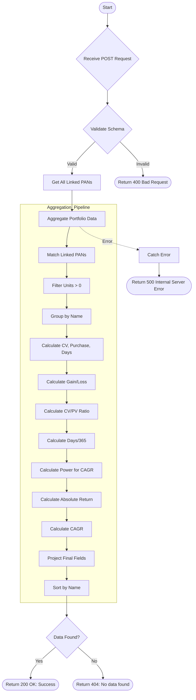

# Get Family Portfolio
Retrieves aggregated portfolio data for all family members linked to a given PAN, including calculations for current value, purchase value, CAGR, gain/loss, and absolute returns.

### User flow diagram


### Method
```
POST
```

### Route
```
/get-family-portfolio
```

### Authorization
```
Bearer <token>
```

### Request Body
```json
{
    "pan": "ABCDE1234F"
}
```

### Response `Status: (200)`
```json
{
    "status": true,
    "message": "Success",
    "payload": {
        "familyPortfolio": [
            {
                "Gpan": "ABCDE1234F",
                "Pan": "ABCDE1234F",
                "Name": "Client Name",
                "Totalpurchase": 100000.50,
                "TotalMarketValue": 125000,
                "Cagr": 12.50,
                "Gainloss": 24999,
                "days": 730,
                "absoluteReturn": 25.00
            },
            {
                "Gpan": "ABCDE1234F",
                "Pan": "FGHIJ5678K",
                "Name": "Family Member Name",
                "Totalpurchase": 50000.25,
                "TotalMarketValue": 55000,
                "Cagr": 8.75,
                "Gainloss": 5000,
                "days": 365,
                "absoluteReturn": 10.00
            }
        ]
    }
}
```

### Response `Status: (404)`
```json
{
    "status": false,
    "message": "No data found"
}
```

### Response `Status: (500)`
```json
{
    "status": false,
    "message": "Internal Server Error"
}
```
