# Get Family Snapshot
Retrieves comprehensive portfolio snapshot for a family by aggregating data across all linked PANs. Calculates total portfolio value, gains/losses, CAGR, asset allocation, and other key financial metrics.

### User flow diagram

```mermaid
flowchart TD
    Start([Start]) --> Request{Receive POST Request}
    Request --> Validate{Validate Schema}
    
    Validate -- Valid --> GetLinkedPans[Get All Linked PANs<br/>getAllLinkedPans function]
    Validate -- Invalid --> Response400([Return 400: Bad Request])
    
    GetLinkedPans --> Aggregate[Aggregate folioWise_portfolio]
    
    subgraph Aggregation_Pipeline
        Aggregate --> Match1[Match: Linked PANs]
        Match1 --> Match2[Match: unit > 0]
        Match2 --> Group[Group: Calculate Totals<br/>currentvalue, purchase, etc.]
        Group --> AddFields1[Add: totalPercent]
        AddFields1 --> AddFields2[Add: cv, purchase, dayspurchase]
        AddFields2 --> AddFields3[Add: days calculation]
        AddFields3 --> AddFields4[Add: gainloss]
        AddFields4 --> AddFields5[Add: dayschange]
        AddFields5 --> AddFields6[Add: newdayschange]
        AddFields6 --> AddFields7[Add: cvpv ratio]
        AddFields7 --> AddFields8[Add: days_by_365]
        AddFields8 --> AddFields9[Add: onebym]
        AddFields9 --> AddFields10[Add: power calculation]
        AddFields10 --> AddFields11[Add: OminusOne]
        AddFields11 --> AddFields12[Add: cvminuspv]
        AddFields12 --> AddFields13[Add: cvminuspvDividePurchase]
        AddFields13 --> AddFields14[Add: abs absolute return]
        AddFields14 --> AddFields15[Add: cagrcalc]
        AddFields15 --> AddFields16[Add: cagrcalulated]
        AddFields16 --> AddFields17[Add: abs_365]
        AddFields17 --> AddFields18[Add: abs_365calc]
        AddFields18 --> AddFields19[Add: cagr final<br/>conditional on days]
        AddFields19 --> AddFields20[Add: dividend = 0]
        AddFields20 --> AddFields21[Add: Asset Allocation %<br/>debt, gold, equity]
        AddFields21 --> Project[Project: Final Fields]
    end
    
    Project --> CheckData{Data Found?}
    
    CheckData -- No --> Response404([Return 404: No data found])
    CheckData -- Yes --> FormatData[Format Data<br/>Round Gainloss<br/>Convert to String]
    
    FormatData --> BuildPayload[Build Payload<br/>totalPortfolio object]
    BuildPayload --> Response200([Return 200: Success])
    
    Aggregate -. Error .-> HandleError[Catch Error]
    GetLinkedPans -. Error .-> HandleError
    HandleError --> Response500([Return 500: Internal Server Error])
```


### Method
```
POST
```

### Route
```
/get-family-snapshot
```

### Authorization
```
Bearer <token>
```

### Request Body
```json
{
    "pan": "ABCDE1234F"
}
```

**Field Details:**
- `pan` (String, Required): Primary PAN number to fetch family snapshot for

### Response `Status: (200)`
```json
{
    "status": true,
    "message": "Success",
    "payload": {
        "totalPortfolio": {
            "Totalpurchase": "5000000.00",
            "Totalmarketvalue": 6500000,
            "Finaldays": 730,
            "Finalcagr": "14.25",
            "Totaldayschange": 15000,
            "Newdayschange": 12000,
            "Gainloss": 1500000,
            "Dividend": 0,
            "debtPercentFinal": "35.50",
            "goldPercentFinal": "10.25",
            "equityPercentFinal": "54.25",
            "absoluteReturn": 30.0
        }
    }
}
```

**Response Field Descriptions:**
- `Totalpurchase`: Total purchase/investment amount
- `Totalmarketvalue`: Current market value of portfolio
- `Finaldays`: Average holding period in days
- `Finalcagr`: Compound Annual Growth Rate (%)
- `Totaldayschange`: Day's change in portfolio value (updated)
- `Newdayschange`: New day's change calculation
- `Gainloss`: Total gain or loss (market value - purchase)
- `Dividend`: Dividend amount (currently 0)
- `debtPercentFinal`: Debt allocation percentage
- `goldPercentFinal`: Gold allocation percentage
- `equityPercentFinal`: Equity allocation percentage
- `absoluteReturn`: Absolute return percentage

### Response `Status: (404)`
```json
{
    "status": false,
    "message": "No data found"
}
```

### Response `Status: (500)`
```json
{
    "status": false,
    "message": "Error message details"
}
```

## Key Calculations

### CAGR Calculation
- **For holdings > 365 days**: Uses compound growth formula: `((CV/PV)^(1/years) - 1) * 100`
- **For holdings ≤ 365 days**: Uses annualized return: `(Absolute Return * 365 / days)`

### Asset Allocation
Calculates percentage distribution across:
- **Equity**: Equity funds percentage
- **Debt**: Debt funds percentage  
- **Gold**: Gold funds percentage

### Gain/Loss
```
Gain/Loss = Current Value - Purchase Value
```

### Absolute Return
```
Absolute Return = ((CV - PV) / PV) * 100
```

## Features

- **Family-wide aggregation**: Combines data across all linked PANs
- **Comprehensive metrics**: CAGR, absolute return, gain/loss, asset allocation
- **Smart CAGR calculation**: Different formulas for short-term vs long-term holdings
- **Asset allocation**: Percentage breakdown by asset class
- **Disk usage allowed**: Uses `.allowDiskUse(true)` for large datasets
