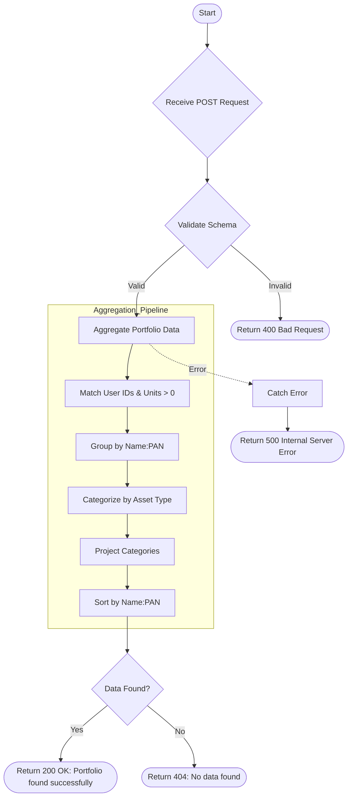

# Portfolio From Clientlist
Retrieves portfolio holdings for multiple clients grouped by name and PAN, categorized by asset type (Debt, Equity, Gold).

### User flow diagram


### Method
```
POST
```

### Route
```
/portfolio-from-clientlist
```

### Authorization
```
Bearer <token>
```

### Request Body
```json
{
    "userids": ["USER001", "USER002", "USER003"]
}
```

### Response `Status: (200)`
```json
{
    "status": true,
    "message": "Portfolio found successfully",
    "payload": {
        "length": 2,
        "portfolio": [
            {
                "_id": "Client Name:ABCDE1234F",
                "Debt": [
                    {
                        "folio": "12345/67",
                        "scheme": "Debt Scheme A",
                        "unit": 100.50,
                        "currentvalue": 15000,
                        "assettype": "DEBT",
                        "name": "Client Name",
                        "pan": "ABCDE1234F"
                    }
                ],
                "Equity": [
                    {
                        "folio": "98765/43",
                        "scheme": "Equity Scheme B",
                        "unit": 50.25,
                        "currentvalue": 25000,
                        "assettype": "EQUITY",
                        "name": "Client Name",
                        "pan": "ABCDE1234F"
                    }
                ],
                "Gold": []
            },
            {
                "_id": "Another Client:FGHIJ5678K",
                "Debt": [],
                "Equity": [
                    {
                        "folio": "11223/44",
                        "scheme": "Equity Scheme C",
                        "unit": 75.00,
                        "currentvalue": 18000,
                        "assettype": "EQUITY",
                        "name": "Another Client",
                        "pan": "FGHIJ5678K"
                    }
                ],
                "Gold": [
                    {
                        "folio": "55667/88",
                        "scheme": "Gold Scheme D",
                        "unit": 10.00,
                        "currentvalue": 5000,
                        "assettype": "GOLD",
                        "name": "Another Client",
                        "pan": "FGHIJ5678K"
                    }
                ]
            }
        ]
    }
}
```

### Response `Status: (404)`
```json
{
    "status": false,
    "message": "No data found"
}
```

### Response `Status: (500)`
```json
{
    "status": false,
    "message": "Internal Server Error"
}
```
