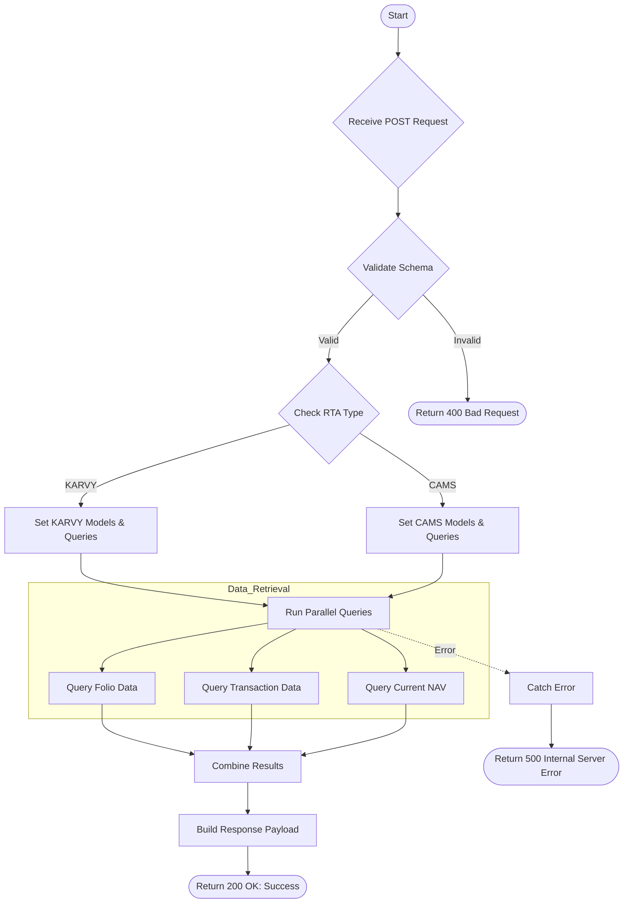

# Portfolio Transaction Detail
Retrieves detailed folio information and transaction history for a specific portfolio, dynamically handling both KARVY and CAMS RTAs with their respective data structures.

### User flow diagram


### Method
```
POST
```

### Route
```
/portfolio-transaction-detail
```

### Authorization
```
Bearer <token>
```

### Request Body
```json
{
    "rta": "KARVY",
    "folio": "12345/67",
    "product": "P001",
    "schemecode": "SCH001"
}
```

**Note:** `rta` can be either "KARVY" or "CAMS".

### Response `Status: (200)`
```json
{
    "status": true,
    "message": "Success",
    "payload": {
        "cnav": 150.25,
        "folioData": {
            "folio": "12345/67",
            "product": "P001",
            "pan": "ABCDE1234F",
            "scheme": "Scheme Name",
            "name": "Client Name",
            "jtname1": "Joint Holder 1",
            "jtname2": "Joint Holder 2",
            "nominee": "Nominee Name",
            "nominee2": "",
            "nominee3": "",
            "moh": "Single",
            "bank": "HDFC Bank",
            "bankaccount": "12345678901234",
            "bankaccounttype": "Savings",
            "ACCORD_STATUS": "Active"
        },
        "transactionData": [
            {
                "_id": "trans123",
                "navdate": "2024-01-15",
                "desc": "Purchase",
                "nature": "BUY",
                "amount": 10000,
                "nav": 100.50,
                "unit": 99.50,
                "ACCORD_STATUS": "Confirmed"
            },
            {
                "_id": "trans124",
                "navdate": "2024-06-20",
                "desc": "Redemption",
                "nature": "SELL",
                "amount": 5000,
                "nav": 120.75,
                "unit": -41.41,
                "ACCORD_STATUS": "Confirmed"
            }
        ],
        "rta": "KARVY"
    }
}
```

### Response `Status: (500)`
```json
{
    "status": false,
    "message": "Internal Server Error"
}
```
