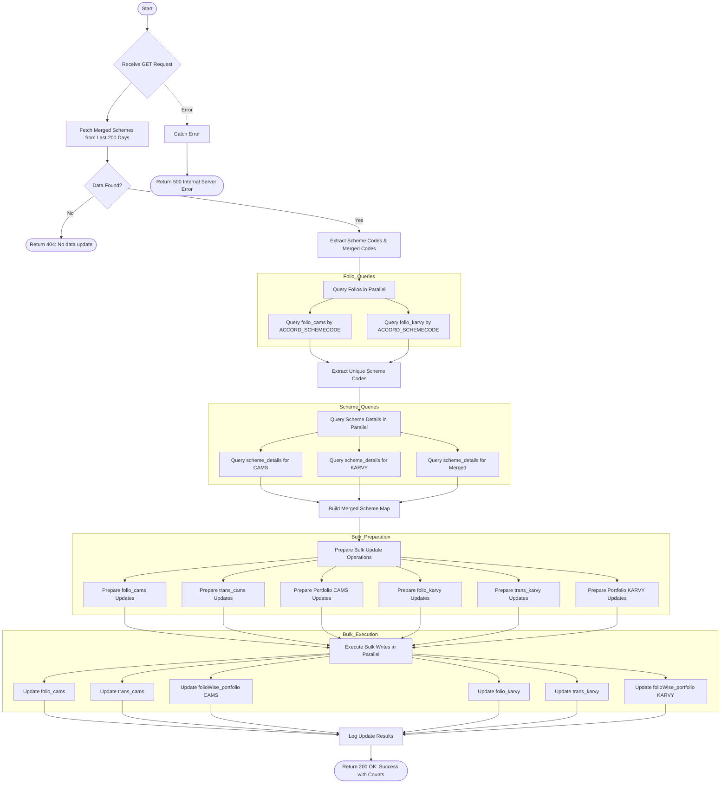

# Update Merged Scheme
Updates scheme information across CAMS and KARVY collections when schemes have been merged. Fetches merged scheme data from the last 200 days, identifies affected folios, retrieves new scheme details, and performs bulk updates across folio, transaction, and portfolio collections for both RTAs.

### User flow diagram


### Method
```
GET
```

### Route
```
/update-merged-scheme
```

### Authorization
```
Bearer <token>
```

### Parameters
| Name | Type | Description |
|------|------|-------------|
| None | - | - |

### Sample Request
```http
GET: https://<host>/update-merged-scheme
```

### Response `Status: (200)`
```json
{
    "success": true,
    "message": "Successfully updated schemes",
    "foliocModified": 15,
    "transcModified": 120,
    "portfoliocModified": 15,
    "foliokModified": 8,
    "transkModified": 65,
    "portfoliokModified": 8
}
```

### Response `Status: (404)`
```json
{
    "status": false,
    "message": "No data update"
}
```

### Response `Status: (500)`
```json
{
    "status": false,
    "message": "Internal Server Error"
}
```
