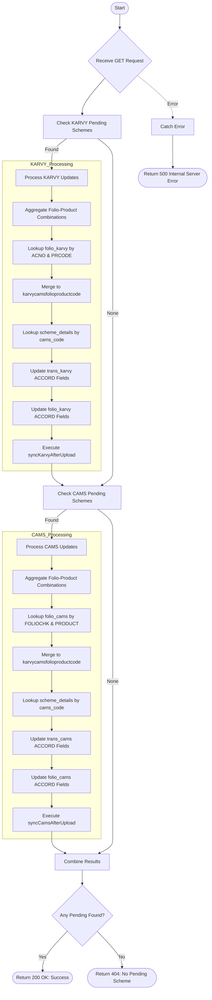

# Update Scheme Status
Updates scheme status from "Pending" to active status for both KARVY and CAMS RTAs by syncing scheme details from scheme_details collection, updating ACCORD_AMFICODE, ACCORD_AMFINAME, and ACCORD_STATUS fields in transaction and folio tables, and merging folio-productcode data into the unified karvycamsfolioproductcode table.

### User flow diagram


### Method
```
GET
```

### Route
```
/update-scheme-status
```

### Authorization
```
Bearer <token>
```

### Parameters
| Name | Type | Description |
|------|------|-------------|
| None | - | - |

### Sample Request
```http
GET: https://<host>/update-scheme-status
```

### Response `Status: (200)`
```json
{
    "status": true,
    "message": "Success"
}
```

### Response `Status: (404)`
```json
{
    "status": false,
    "message": "No Pending Scheme"
}
```

### Response `Status: (500)`
```json
{
    "status": false,
    "message": "Internal Server Error"
}
```
