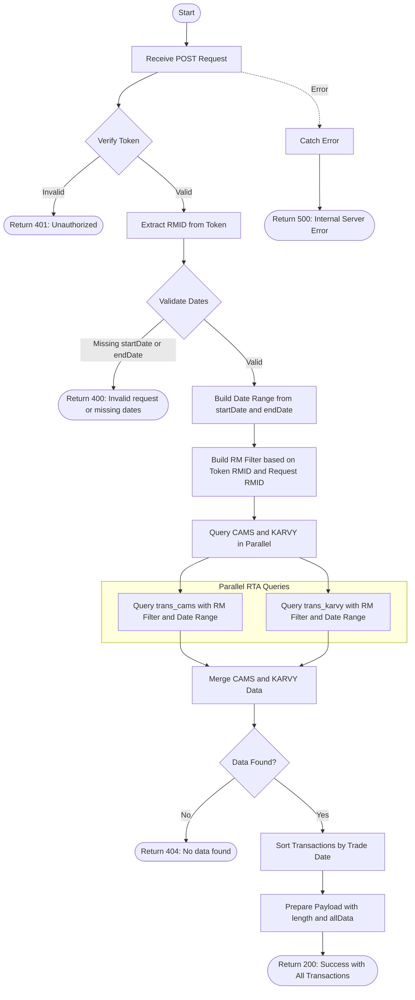

# All Transaction
Retrieves all transaction data within a specified date range, with optional RM (Relationship Manager) filtering. The API aggregates transaction data from both CAMS and KARVY registrars, applies RM-based access control, sorts by trade date, and returns the complete transaction list. This endpoint requires authentication via a bearer token.

### User flow diagram


### Method
```
POST
```

### Route
```
/all-transaction
```

### Authorization
```
Bearer <token>
```

### Request Body
```json
{
    "startDate": "2024-01-01",
    "endDate": "2024-12-31",
    "rmid": 123
}
```

### Parameters
| Name | Type | Description |
|------|------|-------------|
| startDate | String | **Required**. The start date for the transaction range (format: YYYY-MM-DD). |
| endDate | String | **Required**. The end date for the transaction range (format: YYYY-MM-DD). |
| rmid | Number | **Optional**. The Relationship Manager ID to filter transactions. If not provided, uses the RMID from the authentication token. |

### Response `Status: (200)`
```json
{
    "status": true,
    "message": "Success",
    "payload": {
        "length": 3,
        "allData": [
            {
                "INVNAME": "John Doe",
                "FOLIO": "1234567/89",
                "SCHEME": "HDFC Liquid Fund",
                "TRXNNO": "TXN001",
                "TRADDATE": "2024-06-15",
                "UNITS": 100.50,
                "AMOUNT": 50000,
                "TRXNTYPE": "Purchase",
                "PAN": "ABCDE1234F",
                "RMID": 123,
                "RM": "RM Name"
            },
            {
                "INVNAME": "Jane Doe",
                "FOLIO": "9876543/21",
                "SCHEME": "ICICI Prudential Equity Fund",
                "TRXNNO": "TXN002",
                "TRADDATE": "2024-07-20",
                "UNITS": 50.25,
                "AMOUNT": 25000,
                "TRXNTYPE": "Redemption",
                "PAN": "XYZAB5678C",
                "RMID": 123,
                "RM": "RM Name"
            },
            {
                "INVNAME": "Robert Smith",
                "FOLIO": "5555555/55",
                "SCHEME": "SBI Bluechip Fund",
                "TRXNNO": "TXN003",
                "TRADDATE": "2024-08-10",
                "UNITS": 75.00,
                "AMOUNT": 30000,
                "TRXNTYPE": "Purchase",
                "PAN": "PQRST9876Z",
                "RMID": 123,
                "RM": "RM Name"
            }
        ]
    }
}
```

### Response `Status: (400)`
```json
{
    "status": false,
    "message": "Invalid request or missing dates"
}
```

### Response `Status: (401)`
```json
{
    "status": false,
    "message": "Unauthorized"
}
```

### Response `Status: (404)`
```json
{
    "status": false,
    "message": "No data found"
}
```

### Response `Status: (500)`
```json
{
    "status": false,
    "message": "Error message details"
}
```

## API Behavior Details

### Authentication & Authorization
- **Token Required**: This endpoint requires a valid bearer token
- **Token Data**: The token contains the user's RMID (Relationship Manager ID)
- **Access Control**: RM filter is built based on the authenticated user's RMID

### RM Filter Logic
The `buildRMFilter()` function determines which transactions the user can access:
- If `rmid` is provided in the request body, it's used for filtering (subject to user permissions)
- If `rmid` is not provided, the RMID from the authentication token is used
- This ensures users only see transactions they're authorized to access

### Data Aggregation
1. **Parallel Queries**: Simultaneously queries both CAMS and KARVY collections
2. **Pipeline**: Uses `buildPipelineAll()` to construct aggregation pipelines with:
   - RM filter for access control
   - Date range filter (start to end)
   - RTA-specific field mappings
3. **Merge**: Combines results from both RTAs into a single array

### Data Processing
1. **Sorting**: All transactions are sorted by trade date (`TRADDATE`) in chronological order
2. **Response Format**: Returns the total count and complete transaction array
3. **No Grouping**: Unlike `transaction-userwise`, this endpoint returns a flat list of all transactions

### Collections Queried
- **trans_cams**: CAMS transaction collection
- **trans_karvy**: KARVY transaction collection

### Helper Functions Used
- `buildDateRange(startDate, endDate)`: Converts date strings to date range objects
- `buildRMFilter(tokenRMID, requestRMID)`: Constructs RM-based access control filter
- `buildPipelineAll()`: Creates aggregation pipeline for querying all transactions
- `sortByTradDate()`: Sorts transaction array by trade date in ascending order

### Use Cases
- Generate comprehensive transaction reports for a specific period
- Export all transactions for accounting or compliance purposes
- Monitor all client activities within a date range
- RM-specific transaction reporting and analysis
