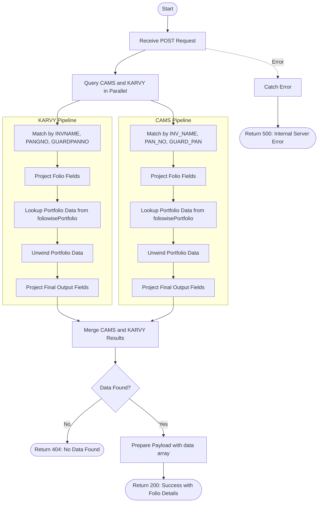

# Download Folio Details
Retrieves comprehensive folio details for a specific investor based on name, PAN, and guardian PAN. The API searches across both CAMS and KARVY folio collections, enriches data with portfolio information (units, current value, purchase value), and returns detailed client information including personal details, bank details, joint holders, nominees, and scheme-wise holdings.

### User flow diagram


### Method
```
POST
```

### Route
```
/download-folio-detail
```

### Authorization
```
None (No token required)
```

### Request Body
```json
{
    "name": "John Doe",
    "pan": "ABCDE1234F",
    "gpan": ""
}
```

### Parameters
| Name | Type | Description |
|------|------|-------------|
| name | String | **Required**. The name of the investor. Performs prefix-based search (starts with). |
| pan | String | **Required**. The PAN of the investor. Must match exactly. |
| gpan | String | **Required**. The guardian PAN (empty string for non-minor accounts). |

### Response `Status: (200)`
```json
{
    "status": true,
    "message": "Success",
    "payload": {
        "data": [
            {
                "NAME": "John Doe",
                "PAN": "ABCDE1234F",
                "FOLIO": "1234567/89",
                "PRCODE": "P001",
                "SCHEME": "HDFC Equity Fund",
                "UNIT": 100.50,
                "CURRENTVALUE": 150000,
                "PURCHASE": 120000,
                "EMAIL": "john.doe@example.com",
                "MOBILE": "9876543210",
                "DOB": "01-01-1980",
                "MODEOFHOLD": "Single",
                "STATUS": "Individual",
                "ADD1": "Street Name",
                "ADD2": "Building",
                "ADD3": "Area",
                "PIN": "400001",
                "CITY": "Mumbai",
                "STATE": "Maharashtra",
                "COUNTRY": "INDIA",
                "BANK": "HDFC Bank",
                "ACCOUNT": "123456789",
                "BNKACTYPE": "Savings",
                "IFSC": "HDFC0000001",
                "BADD1": "Bank Street",
                "BADD2": "Bank Building",
                "BADD3": "Bank Area",
                "BCITY": "Mumbai",
                "JTNAME1": "",
                "JTPAN1": "",
                "JTNAME2": "",
                "JTPAN2": "",
                "GUARDPAN": "",
                "GUARDNAME": "",
                "NOMINEE1": "Jane Doe",
                "NOMINEEREL": "Spouse",
                "NOMINEE2": "",
                "NOMINEE2R2": "",
                "NOMINEE3": "",
                "NOMINEE3R3": "",
                "OCCP_DESC": "Business",
                "RMID": 123,
                "RM": "RM Name"
            }
        ]
    }
}
```

### Response `Status: (404)`
```json
{
    "status": false,
    "message": "No Data Found"
}
```

### Response `Status: (500)`
```json
{
    "status": false,
    "message": "Error message details"
}
```

## API Behavior Details

### Authentication & Authorization
- **No Authentication**: This endpoint does not require a bearer token
- **No Access Control**: No RM-based filtering applied

### Search Logic
- **Name Match**: Prefix-based regex search (starts with) on investor name
- **PAN Match**: Exact match on PAN field
- **Guardian PAN Match**: Exact match on guardian PAN field (empty string for non-minors)
- **Case Insensitive**: Name search is case-insensitive using `$options: 'i'`
- **Scheme Filter**: Excludes schemes with `ACCORD_SHORTNAME = "hello"`

### Data Aggregation Pipeline

#### KARVY Pipeline Stages:
1. **Match**: Filters by `INVNAME`, `PANGNO`, `GUARDPANNO`, and excludes test schemes
2. **Project**: Maps KARVY fields to standardized field names
3. **Lookup**: Joins with `foliowisePortfolio` collection on folio and product code
4. **Unwind**: Flattens portfolio data (preserves records without portfolio match)
5. **Project**: Formats final output with portfolio data (units, current value, purchase value)

#### CAMS Pipeline Stages:
1. **Match**: Filters by `INV_NAME`, `PAN_NO`, `GUARD_PAN`, and excludes test schemes
2. **Project**: Maps CAMS fields to standardized field names
3. **Lookup**: Joins with `foliowisePortfolio` collection on folio and product code
4. **Unwind**: Flattens portfolio data (preserves records without portfolio match)
5. **Project**: Formats final output with portfolio data (units, current value, purchase value)

### Field Mapping

| Category | CAMS Field | KARVY Field | Output Field |
|----------|-----------|-------------|--------------|
| **Personal** | `INV_NAME` | `INVNAME` | `NAME` |
| | `PAN_NO` | `PANGNO` | `PAN` |
| | `INV_DOB` | `DOB` | `DOB` |
| | `MOBILE_NO` | `MOBILE` | `MOBILE` |
| | `EMAIL` | `EMAIL` | `EMAIL` |
| | `OCCUPATION` | `OCCP_DESC` | `OCCP_DESC` |
| **Folio** | `FOLIOCHK` | `ACNO` | `FOLIO` |
| | `PRODUCT` | `PRCODE` | `PRCODE` |
| | `ACCORD_SHORTNAME` | `ACCORD_SHORTNAME` | `SCHEME` |
| | `HOLDING_NA` | `MODEOFHOLD` | `MODEOFHOLD` |
| | `TAX_STATUS` | `STATUSDESC` | `STATUS` |
| **Address** | `ADDRESS1` | `ADD1` | `ADD1` |
| | `ADDRESS2` | `ADD2` | `ADD2` |
| | `ADDRESS3` | `ADD3` | `ADD3` |
| | `CITY` | `CITY` | `CITY` |
| | `PINCODE` | `PIN` | `PIN` |
| | `COUNTRY` | `COUNTRY` | `COUNTRY` |
| **Bank** | `BANK_NAME` | `BNAME` | `BANK` |
| | `AC_NO` | `BNKACNO` | `ACCOUNT` |
| | `AC_TYPE` | `BNKACTYPE` | `BNKACTYPE` |
| | `IFSC_CODE` | `IFSC` | `IFSC` |
| | `B_ADDRESS1` | `BADD1` | `BADD1` |
| | `B_CITY` | `BCITY` | `BCITY` |
| **Joint Holders** | `JNT_NAME1` | `JTNAME1` | `JTNAME1` |
| | `JOINT1_PAN` | `PAN2` | `JTPAN1` |
| | `JNT_NAME2` | `JTNAME2` | `JTNAME2` |
| | `JOINT2_PAN` | `PAN3` | `JTPAN2` |
| **Guardian** | `GUARD_PAN` | `GUARDPANNO` | `GUARDPAN` |
| | `GUARD_NAME` | `GUARDIANN0` | `GUARDNAME` |
| **Nominees** | `NOM_NAME` | `NOMINEE` | `NOMINEE1` |
| | `RELATION` | `NOMINEEREL` | `NOMINEEREL` |
| | `NOM2_NAME` | `NOMINEE2` | `NOMINEE2` |
| | `NOM2_RELAT` | `NOMINEE2R2` | `NOMINEE2R2` |
| | `NOM3_NAME` | `NOMINEE3` | `NOMINEE3` |
| | `NOM3_RELAT` | `NOMINEE3R3` | `NOMINEE3R3` |
| **Portfolio** | From lookup | From lookup | `UNIT` |
| | From lookup | From lookup | `CURRENTVALUE` |
| | From lookup | From lookup | `PURCHASE` |
| **RM** | `RMID` | `RMID` | `RMID` |
| | `RM` | `RM` | `RM` |

### Collections Queried
- **folio_karvy**: KARVY folio collection
- **folio_cams**: CAMS folio collection
- **foliowisePortfolio**: Portfolio holdings collection (lookup)

### Data Processing
1. **Parallel Execution**: Queries both CAMS and KARVY simultaneously
2. **Portfolio Enrichment**: Joins with portfolio data to get units, current value, and purchase value
3. **Preserve Null**: Uses `preserveNullAndEmptyArrays: true` to keep folios without portfolio data
4. **Merge**: Combines results from both RTAs into a single array
5. **No Sorting**: Results are returned in database order

### Use Cases
- Download complete client folio details for reporting
- Generate client portfolio statements
- KYC documentation and verification
- Client onboarding data export
- Compliance and audit reporting
- Portfolio analysis with personal and bank details
- Client data migration or backup

### Response Fields
- **Personal Details**: NAME, PAN, DOB, MOBILE, EMAIL, OCCP_DESC
- **Folio Details**: FOLIO, PRCODE, SCHEME, MODEOFHOLD, STATUS
- **Portfolio Data**: UNIT, CURRENTVALUE, PURCHASE
- **Address**: ADD1, ADD2, ADD3, PIN, CITY, STATE, COUNTRY
- **Bank Details**: BANK, ACCOUNT, BNKACTYPE, IFSC, BADD1-3, BCITY
- **Joint Holders**: JTNAME1, JTPAN1, JTNAME2, JTPAN2
- **Guardian**: GUARDPAN, GUARDNAME (for minor accounts)
- **Nominees**: NOMINEE1-3, NOMINEEREL, NOMINEE2R2, NOMINEE3R3
- **RM Details**: RMID, RM

### Notes
- Returns all folios matching the criteria (one record per folio-scheme combination)
- Portfolio data (UNIT, CURRENTVALUE, PURCHASE) may be null if not found in foliowisePortfolio
- Excludes test schemes where `ACCORD_SHORTNAME = "hello"`
- No date range filtering - returns current folio status
