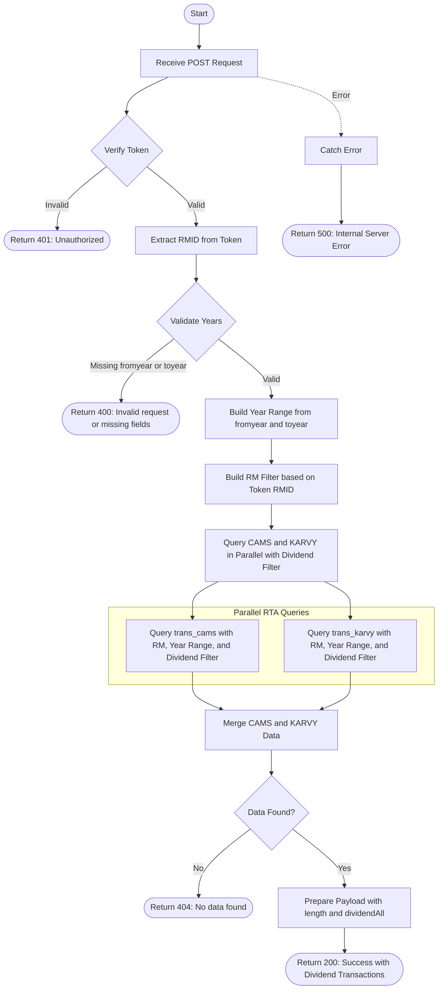

# Get Dividend All Transactions
Retrieves all dividend transactions within a specified financial year range, with RM (Relationship Manager) based access control. The API aggregates dividend transaction data from both CAMS and KARVY registrars, filters for dividend-related transactions (dividend payout, dividend reinvestment), and returns the complete transaction list. This endpoint requires authentication via a bearer token.

### User flow diagram


### Method
```
POST
```

### Route
```
/get-dividend-all
```

### Authorization
```
Bearer <token>
```

### Request Body
```json
{
    "fromyear": "2023",
    "toyear": "2024"
}
```

### Parameters
| Name | Type | Description |
|------|------|-------------|
| fromyear | String | **Required**. The starting financial year for the transaction range (format: YYYY). |
| toyear | String | **Required**. The ending financial year for the transaction range (format: YYYY). |

### Response `Status: (200)`
```json
{
    "status": true,
    "message": "Success",
    "payload": {
        "length": 3,
        "dividendAll": [
            {
                "INVNAME": "John Doe",
                "FOLIO": "1234567/89",
                "SCHEME": "HDFC Equity Fund",
                "TRXNNO": "DIV001",
                "TRADDATE": "2023-06-15",
                "UNITS": 0,
                "AMOUNT": 5000,
                "TRXNTYPE": "Dividend Payout",
                "PAN": "ABCDE1234F",
                "RMID": 123,
                "RM": "RM Name"
            },
            {
                "INVNAME": "Jane Doe",
                "FOLIO": "9876543/21",
                "SCHEME": "ICICI Prudential Balanced Fund",
                "TRXNNO": "DIV002",
                "TRADDATE": "2023-12-20",
                "UNITS": 15.50,
                "AMOUNT": 3000,
                "TRXNTYPE": "Dividend Reinvestment",
                "PAN": "XYZAB5678C",
                "RMID": 123,
                "RM": "RM Name"
            },
            {
                "INVNAME": "Robert Smith",
                "FOLIO": "5555555/55",
                "SCHEME": "SBI Bluechip Fund",
                "TRXNNO": "DIV003",
                "TRADDATE": "2024-01-10",
                "UNITS": 0,
                "AMOUNT": 2500,
                "TRXNTYPE": "Dividend Payout",
                "PAN": "PQRST9876Z",
                "RMID": 123,
                "RM": "RM Name"
            }
        ]
    }
}
```

### Response `Status: (400)`
```json
{
    "status": false,
    "message": "Invalid request or missing fields"
}
```

### Response `Status: (401)`
```json
{
    "status": false,
    "message": "Unauthorized"
}
```

### Response `Status: (404)`
```json
{
    "status": false,
    "message": "No data found"
}
```

### Response `Status: (500)`
```json
{
    "status": false,
    "message": "Error message details"
}
```

## API Behavior Details

### Authentication & Authorization
- **Token Required**: This endpoint requires a valid bearer token
- **Token Data**: The token contains the user's RMID (Relationship Manager ID)
- **Access Control**: RM filter is built based on the authenticated user's RMID
- **No RMID Override**: Unlike some endpoints, this does not accept an `rmid` parameter in the request body

### Year Range Logic
- **Financial Year Based**: Uses `buildYearRange()` to construct date ranges based on financial years
- **Format**: Years are provided as strings (e.g., "2023", "2024")
- **Range**: Includes all transactions from the start of `fromyear` to the end of `toyear`

### RM Filter Logic
The `buildRMFilter()` function determines which transactions the user can access:
- Uses only the RMID from the authentication token
- No override capability via request body
- Ensures users only see dividend transactions for their assigned clients

### Dividend Filter
- **Dividend Flag**: The pipeline includes a dividend filter flag (6th parameter = `true`)
- **Transaction Types**: Filters for dividend-related transactions including:
  - Dividend Payout (cash dividend paid to investor)
  - Dividend Reinvestment (dividend reinvested to purchase additional units)
- **Filter Application**: Applied to both CAMS and KARVY queries via the pipeline

### Data Aggregation
1. **Parallel Queries**: Simultaneously queries both CAMS and KARVY collections
2. **Pipeline**: Uses `buildPipelineAll()` to construct aggregation pipelines with:
   - RM filter for access control
   - Year range filter (financial year based)
   - Dividend filter (6th parameter = `true`)
   - RTA-specific field mappings
3. **Merge**: Combines results from both RTAs into a single array

### Data Processing
1. **No Sorting**: Unlike other endpoints, this does not explicitly sort by trade date
2. **Response Format**: Returns the total count and complete transaction array
3. **No Grouping**: Returns a flat list of all dividend transactions

### Collections Queried
- **trans_cams**: CAMS transaction collection
- **trans_karvy**: KARVY transaction collection

### Helper Functions Used
- `buildYearRange(fromyear, toyear)`: Converts year strings to financial year date range objects
- `buildRMFilter(tokenRMID)`: Constructs RM-based access control filter (single parameter version)
- `buildPipelineAll()`: Creates aggregation pipeline for querying all transactions with dividend filter

### Key Differences from Other Transaction Endpoints
1. **Year Range**: Uses financial years instead of specific dates
2. **Dividend Filter**: Specifically filters for dividend transactions (6th parameter = `true`)
3. **No Date Sorting**: Results are not explicitly sorted
4. **No RMID Override**: Cannot specify different RMID in request body
5. **Financial Year Focus**: Designed for annual dividend reporting

### Dividend Transaction Types
- **Dividend Payout**: Cash dividend credited to investor's bank account (UNITS = 0)
- **Dividend Reinvestment**: Dividend amount used to purchase additional units (UNITS > 0)

### Use Cases
- Generate annual dividend income reports
- Track dividend earnings for tax reporting
- Financial year-end dividend analysis
- Client dividend portfolio performance
- Income distribution reporting
- RM-specific dividend transaction monitoring
- Annual dividend statement generation
- Tax planning based on dividend income

### Response Fields
- **INVNAME**: Full name of the investor
- **FOLIO**: Folio number
- **SCHEME**: Scheme name that declared dividend
- **TRXNNO**: Transaction number
- **TRADDATE**: Trade date (dividend declaration/payment date)
- **UNITS**: Number of units (0 for payout, >0 for reinvestment)
- **AMOUNT**: Dividend amount
- **TRXNTYPE**: Transaction type (Dividend Payout or Dividend Reinvestment)
- **PAN**: Permanent Account Number
- **RMID**: Relationship Manager ID
- **RM**: Relationship Manager name
- **length**: Total number of dividend transactions found
