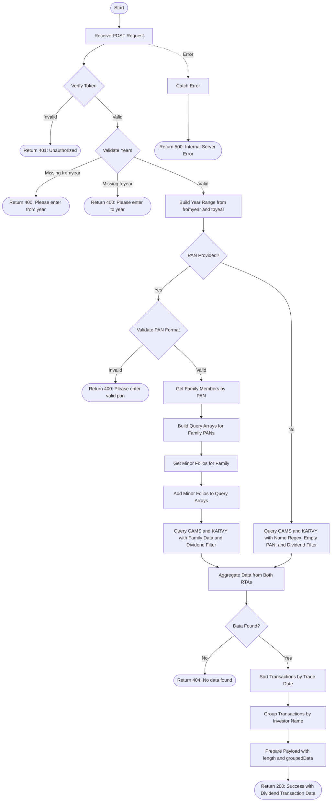

# Get Dividend Userwise Transactions
Retrieves dividend transactions for a specific user based on optional name and PAN, within a specified financial year range. When a PAN is provided, the API fetches transactions for the entire family (including family members and minor folios). Data is aggregated from both CAMS and KARVY registrars, filtered for dividend transactions (payout and reinvestment), sorted by trade date, and grouped by investor name.

### User flow diagram


### Method
```
POST
```

### Route
```
/get-dividend-userwise
```

### Authorization
```
Bearer <token>
```

### Request Body
```json
{
    "pan": "ABCDE1234F",
    "name": "John Doe",
    "fromyear": "2023",
    "toyear": "2024"
}
```

### Parameters
| Name | Type | Description |
|------|------|-------------|
| fromyear | String | **Required**. The starting financial year for the transaction range (format: YYYY). |
| toyear | String | **Required**. The ending financial year for the transaction range (format: YYYY). |
| pan | String | **Optional**. The PAN of the investor. If provided, fetches transactions for entire family including minors. Must match format: 5 letters, 4 digits, 1 letter. |
| name | String | **Optional**. The name of the investor to search for (used when PAN is not provided). |

### Response `Status: (200)`
```json
{
    "status": true,
    "message": "Success",
    "payload": {
        "length": 2,
        "groupedData": {
            "John Doe": [
                {
                    "INVNAME": "John Doe",
                    "FOLIO": "1234567/89",
                    "SCHEME": "HDFC Equity Fund",
                    "TRXNNO": "DIV001",
                    "TRADDATE": "2023-06-15",
                    "UNITS": 0,
                    "AMOUNT": 5000,
                    "TRXNTYPE": "Dividend Payout",
                    "PAN": "ABCDE1234F"
                },
                {
                    "INVNAME": "John Doe",
                    "FOLIO": "1234567/89",
                    "SCHEME": "ICICI Prudential Balanced Fund",
                    "TRXNNO": "DIV002",
                    "TRADDATE": "2023-12-20",
                    "UNITS": 15.50,
                    "AMOUNT": 3000,
                    "TRXNTYPE": "Dividend Reinvestment",
                    "PAN": "ABCDE1234F"
                }
            ],
            "Jane Doe": [
                {
                    "INVNAME": "Jane Doe",
                    "FOLIO": "9876543/21",
                    "SCHEME": "SBI Bluechip Fund",
                    "TRXNNO": "DIV003",
                    "TRADDATE": "2024-01-10",
                    "UNITS": 0,
                    "AMOUNT": 2500,
                    "TRXNTYPE": "Dividend Payout",
                    "PAN": "XYZAB5678C"
                }
            ]
        }
    }
}
```

### Response `Status: (400)`
```json
{
    "status": false,
    "message": "Please enter from year"
}
```

```json
{
    "status": false,
    "message": "Please enter to year"
}
```

```json
{
    "status": false,
    "message": "Please enter valid pan"
}
```

### Response `Status: (401)`
```json
{
    "status": false,
    "message": "Unauthorized"
}
```

### Response `Status: (404)`
```json
{
    "status": false,
    "message": "No data found"
}
```

### Response `Status: (500)`
```json
{
    "status": false,
    "message": "Error message details"
}
```

## API Behavior Details

### Authentication & Authorization
- **Token Required**: This endpoint requires a valid bearer token
- **No RM Filter**: Unlike other endpoints, this does not apply RM-based filtering

### PAN Validation
- PAN format: 5 uppercase letters + 4 digits + 1 uppercase letter
- Example: `ABCDE1234F`
- Validation is case-insensitive

### Year Range Logic
- **Financial Year Based**: Uses `buildYearRange()` to construct date ranges based on financial years
- **Format**: Years are provided as strings (e.g., "2023", "2024")
- **Range**: Includes all transactions from the start of `fromyear` to the end of `toyear`

### Dividend Filter
- **Dividend Flag**: The pipeline includes a dividend filter flag (6th parameter = `true`)
- **Transaction Types**: Filters for dividend-related transactions including:
  - Dividend Payout (cash dividend paid to investor)
  - Dividend Reinvestment (dividend reinvested to purchase additional units)
- **Filter Application**: Applied to both CAMS and KARVY queries via the pipeline

### Query Logic

#### With PAN:
1. Fetches all family members associated with the PAN
2. Retrieves minor folios for the family
3. Builds query arrays for both CAMS and KARVY:
   - **CAMS**: Matches on `PAN` field for family members and `FOLIO_NO` for minors
   - **KARVY**: Matches on `PAN1` field for family members and `TD_ACNO` for minors
4. Adds dividend filter to both queries
5. Aggregates data from both RTAs using the family query

#### Without PAN (Name-based):
1. Searches by name using regex (case-insensitive)
2. Filters for records with empty PAN field
3. Adds dividend filter
4. Queries both CAMS (`INV_NAME`) and KARVY (`INVNAME`) collections

**Note**: The code references `DESC: trans_type` in the without-PAN case, but `trans_type` is not defined in the request body. This appears to be a code issue that may need correction.

### Data Processing
1. **Aggregation**: Combines data from both CAMS and KARVY RTAs
2. **Sorting**: Transactions are sorted by trade date (`TRADDATE`)
3. **Grouping**: Results are grouped by investor name (`INVNAME`)
4. **Payload**: Returns the count of unique investors and their grouped transactions

### Collections Queried
- **trans_cams**: CAMS transaction collection
- **trans_karvy**: KARVY transaction collection

### Helper Functions Used
- `buildYearRange(fromyear, toyear)`: Converts year strings to financial year date range objects
- `getfamilymember(pan)`: Retrieves family members for a given PAN
- `getminorfolio(familyMembers)`: Fetches minor folios for family members
- `buildPipelineUserwise()`: Constructs aggregation pipeline for user-specific transaction queries with dividend filter
- `buildPipeline()`: Constructs aggregation pipeline for name-based queries with dividend filter
- `sortByTradDate()`: Sorts transaction array by trade date

### Key Differences from `/get-dividend-all`
1. **User-Specific**: Filters by specific user PAN or name
2. **Family Support**: Includes family members and minors when PAN is provided
3. **Grouping**: Results are grouped by investor name
4. **No RM Filter**: Does not apply RM-based access control
5. **Optional Name**: Can search by name if PAN is not provided

### Dividend Transaction Types
- **Dividend Payout**: Cash dividend credited to investor's bank account (UNITS = 0)
- **Dividend Reinvestment**: Dividend amount used to purchase additional units (UNITS > 0)

### Use Cases
- Generate user-specific dividend income reports
- Track individual client dividend earnings
- Monitor family dividend income including minors
- Client-wise dividend portfolio analysis
- Annual dividend statement for specific investors
- Tax planning based on individual dividend income
- Family dividend income consolidation

### Response Fields
- **INVNAME**: Full name of the investor
- **FOLIO**: Folio number
- **SCHEME**: Scheme name that declared dividend
- **TRXNNO**: Transaction number
- **TRADDATE**: Trade date (dividend declaration/payment date)
- **UNITS**: Number of units (0 for payout, >0 for reinvestment)
- **AMOUNT**: Dividend amount
- **TRXNTYPE**: Transaction type (Dividend Payout or Dividend Reinvestment)
- **PAN**: Permanent Account Number
- **length**: Total number of unique investors with dividend transactions
- **groupedData**: Transactions grouped by investor name
