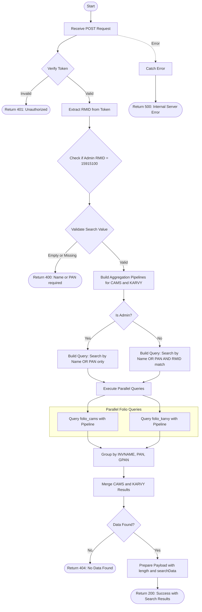

# Get Search by Name or PAN
Searches for clients by name or PAN across both CAMS and KARVY folio collections. The API performs a prefix-based regex search, applies RM-based access control (unless user is admin), and returns unique client records grouped by investor name, PAN, and guardian PAN. This endpoint requires authentication via a bearer token.

### User flow diagram


### Method
```
POST
```

### Route
```
/get-search-name-pan
```

### Authorization
```
Bearer <token>
```

### Request Body
```json
{
    "name": "John"
}
```

or

```json
{
    "name": "ABCDE1234F"
}
```

### Parameters
| Name | Type | Description |
|------|------|-------------|
| name | String | **Required**. The search value - can be either a client name or PAN. Performs prefix-based search (starts with). |

### Response `Status: (200)`
```json
{
    "status": true,
    "message": "Success",
    "payload": {
        "length": 3,
        "searchData": [
            {
                "INVNAME": "John Doe",
                "PAN": "ABCDE1234F",
                "GPAN": ""
            },
            {
                "INVNAME": "John Smith",
                "PAN": "XYZAB5678C",
                "GPAN": ""
            },
            {
                "INVNAME": "Johnny Walker",
                "PAN": "PQRST9876Z",
                "GPAN": "GUARD1234A"
            }
        ]
    }
}
```

### Response `Status: (400)`
```json
{
    "status": false,
    "message": "Name or PAN required"
}
```

### Response `Status: (401)`
```json
{
    "status": false,
    "message": "Unauthorized"
}
```

### Response `Status: (404)`
```json
{
    "status": false,
    "message": "No Data Found"
}
```

### Response `Status: (500)`
```json
{
    "status": false,
    "message": "Error message details"
}
```

## API Behavior Details

### Authentication & Authorization
- **Token Required**: This endpoint requires a valid bearer token
- **Token Data**: The token contains the user's RMID (Relationship Manager ID)
- **Admin Check**: Special admin RMID `15915100` has unrestricted access to all records
- **RM Filter**: Non-admin users can only search within their own client portfolio

### Search Logic

#### Search Pattern
- **Prefix Match**: Uses regex pattern `^${searchValue}.*` (starts with)
- **Case Insensitive**: Search is case-insensitive using `$options: "i"`
- **Multi-Field**: Searches across both name and PAN fields simultaneously

#### Admin vs Non-Admin Query

**Admin User (RMID = 15915100):**
```javascript
{
  $or: [
    { INV_NAME: { $regex: "^searchValue.*", $options: "i" } },
    { PAN_NO: { $regex: "^searchValue.*", $options: "i" } }
  ]
}
```

**Non-Admin User:**
```javascript
{
  $and: [
    {
      $or: [
        { INV_NAME: { $regex: "^searchValue.*", $options: "i" } },
        { PAN_NO: { $regex: "^searchValue.*", $options: "i" } }
      ]
    },
    { RMID: "userRMID" }
  ]
}
```

### Data Aggregation

#### Pipeline Stages
1. **Match Stage**: Filters records based on search criteria and RM access
2. **Group Stage**: Groups by unique combination of:
   - Investor Name (`INVNAME`)
   - PAN (`PAN`)
   - Guardian PAN (`GPAN`)
3. **Project Stage**: Formats output with clean field names

#### Field Mapping

| Field | CAMS Collection | KARVY Collection |
|-------|----------------|------------------|
| Investor Name | `INV_NAME` | `INVNAME` |
| PAN | `PAN_NO` | `PANGNO` |
| Guardian PAN | `GUARD_PAN` | `GUARDPANNO` |
| RM ID | `RMID` | `RMID` |

### Collections Queried
- **folio_cams**: CAMS folio collection
- **folio_karvy**: KARVY folio collection

### Data Processing
1. **Parallel Execution**: Queries both CAMS and KARVY simultaneously using `Promise.all()`
2. **Deduplication**: Grouping ensures unique records per investor-PAN-GPAN combination
3. **Merge**: Combines results from both RTAs into a single array
4. **No Sorting**: Results are returned in the order received from the database

### Use Cases
- Quick client lookup by name prefix
- Search clients by PAN number
- Autocomplete functionality for client selection
- Client verification before performing operations
- RM-specific client search with access control

### Response Fields
- **INVNAME**: Full name of the investor
- **PAN**: Permanent Account Number of the investor
- **GPAN**: Guardian PAN (populated for minor accounts, empty otherwise)
- **length**: Total number of unique client records found
