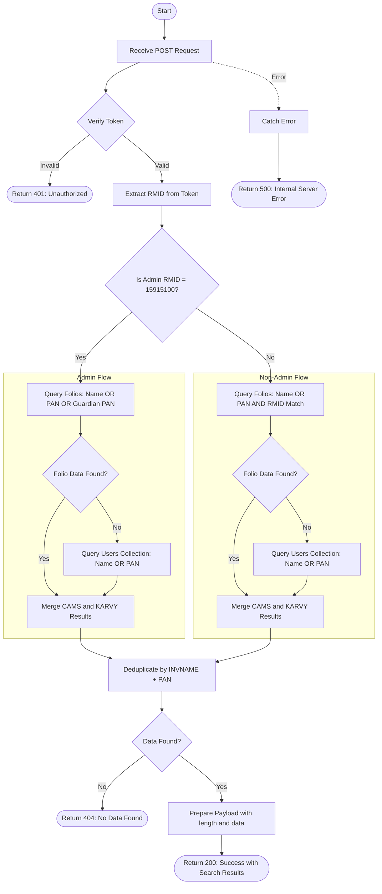

# Get Search by Name or PAN with RM Filter
Searches for clients by name or PAN across CAMS and KARVY folio collections, with fallback to the Users collection if no folio data is found. The API performs prefix-based regex search, applies RM-based access control (unless user is admin), includes guardian PAN in search criteria, returns USER_ID along with client details, and automatically deduplicates results. This endpoint requires authentication via a bearer token.

### User flow diagram


### Method
```
POST
```

### Route
```
/get-search-name-pan-rm
```

### Authorization
```
Bearer <token>
```

### Request Body
```json
{
    "name": "John"
}
```

or

```json
{
    "name": "ABCDE1234F"
}
```

### Parameters
| Name | Type | Description |
|------|------|-------------|
| name | String | **Required**. The search value - can be either a client name, PAN, or guardian PAN. Performs prefix-based search (starts with). |

### Response `Status: (200)`
```json
{
    "status": true,
    "message": "Success",
    "payload": {
        "length": 3,
        "data": [
            {
                "INVNAME": "John Doe",
                "PAN": "ABCDE1234F",
                "GPAN": "",
                "USER_ID": 12345
            },
            {
                "INVNAME": "John Smith",
                "PAN": "XYZAB5678C",
                "GPAN": "GUARD1234A",
                "USER_ID": 67890
            },
            {
                "INVNAME": "JOHNNY WALKER",
                "PAN": "PQRST9876Z",
                "GPAN": ""
            }
        ]
    }
}
```

### Response `Status: (401)`
```json
{
    "status": false,
    "message": "Unauthorized"
}
```

### Response `Status: (404)`
```json
{
    "status": false,
    "message": "No Data Found"
}
```

### Response `Status: (500)`
```json
{
    "status": false,
    "message": "Error message details"
}
```

## API Behavior Details

### Authentication & Authorization
- **Token Required**: This endpoint requires a valid bearer token
- **Token Data**: The token contains the user's RMID (Relationship Manager ID)
- **Admin Check**: Special admin RMID `15915100` has unrestricted access to all records
- **RM Filter**: Non-admin users can only search within their own client portfolio

### Search Logic

#### Search Fields

**Admin User (RMID = 15915100):**
- Searches across 3 fields in folio collections:
  - Investor Name
  - PAN
  - Guardian PAN
- If no folio data found, searches Users collection by name and PAN

**Non-Admin User:**
- Searches across 2 fields in folio collections (with RMID filter):
  - Investor Name
  - PAN
- Guardian PAN is NOT included in search criteria for non-admin users
- If no folio data found, searches Users collection by name and PAN

#### Query Structure

**Admin Folio Query:**
```javascript
{
  $or: [
    { INV_NAME: { $regex: "^searchValue.*", $options: "i" } },
    { PAN_NO: { $regex: "^searchValue.*", $options: "i" } },
    { GUARD_PAN: { $regex: "^searchValue.*", $options: "i" } }
  ]
}
```

**Non-Admin Folio Query:**
```javascript
{
  $and: [
    {
      $or: [
        { INV_NAME: { $regex: "^searchValue.*", $options: "i" } },
        { PAN_NO: { $regex: "^searchValue.*", $options: "i" } }
      ]
    },
    { RMID: "userRMID" }
  ]
}
```

**Users Collection Fallback Query:**
```javascript
{
  $or: [
    { name: { $regex: "^searchValue.*", $options: "i" } },
    { PAN: { $regex: "^searchValue.*", $options: "i" } }
  ]
}
```

### Data Aggregation

#### Pipeline Stages
1. **Match Stage**: Filters records based on search criteria and RM access
2. **Group Stage**: Groups by unique combination of INVNAME, PAN, GPAN and captures first USER_ID
3. **Project Stage**: Formats output with standardized field names

#### Field Mapping

| Field | CAMS Collection | KARVY Collection | Users Collection |
|-------|----------------|------------------|------------------|
| Investor Name | `INV_NAME` | `INVNAME` | `name` (uppercase) |
| PAN | `PAN_NO` | `PANGNO` | `PAN` |
| Guardian PAN | `GUARD_PAN` | `GUARDPANNO` | `""` (empty) |
| User ID | `USER_ID` | `USER_ID` | Not included |

### Fallback Mechanism
1. **Primary Search**: Queries folio collections (CAMS and KARVY)
2. **Fallback**: If no folio data found (`data.length == 0`), queries Users collection
3. **Users Data**: Returns uppercase investor name with empty GPAN field
4. **No USER_ID**: Users collection results don't include USER_ID field

### Deduplication
- Uses a filter function to remove duplicates based on `INVNAME + '|' + PAN` combination
- Ensures each unique client appears only once in results
- Maintains first occurrence of duplicate records

### Collections Queried
- **folio_cams**: CAMS folio collection (primary)
- **folio_karvy**: KARVY folio collection (primary)
- **Users**: User master collection (fallback)

### Data Processing
1. **Parallel Execution**: Queries CAMS and KARVY simultaneously
2. **Merge**: Combines results from both RTAs
3. **Fallback Check**: If merged data is empty, queries Users collection
4. **Deduplication**: Removes duplicate entries by INVNAME+PAN key
5. **No Sorting**: Results are returned in database order

### Key Differences from `/get-search-name-pan`
1. **Guardian PAN Search**: Admin users can search by guardian PAN
2. **USER_ID Field**: Returns USER_ID for mapping to user accounts
3. **Fallback to Users**: Searches Users collection if no folio data found
4. **Deduplication**: Automatically removes duplicates
5. **Response Structure**: Uses `data` instead of `searchData` in payload

### Use Cases
- Client lookup with user account mapping
- Search including guardian/minor accounts (admin only)
- Fallback search for clients without folio data
- RM-specific client search with access control
- Autocomplete with user ID for subsequent operations

### Response Fields
- **INVNAME**: Full name of the investor (uppercase from Users collection)
- **PAN**: Permanent Account Number of the investor
- **GPAN**: Guardian PAN (populated for minor accounts, empty otherwise)
- **USER_ID**: User account ID (present for folio records, absent for Users collection records)
- **length**: Total number of unique client records found after deduplication
