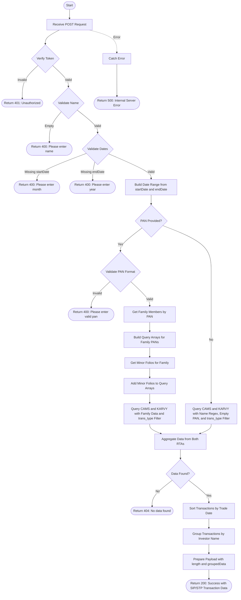

# SIP/STP Userwise Transactions
Retrieves SIP (Systematic Investment Plan) or STP (Systematic Transfer Plan) transactions for a specific user based on name and optional PAN, within a specified date range. When a PAN is provided, the API fetches transactions for the entire family (including family members and minor folios). Data is aggregated from both CAMS and KARVY registrars, filtered by transaction type (SIP/STP), sorted by trade date, and grouped by investor name.

### User flow diagram


### Method
```
POST
```

### Route
```
/sip-stp-userwise
```

### Authorization
```
Bearer <token>
```

### Request Body
```json
{
    "pan": "ABCDE1234F",
    "name": "John Doe",
    "startDate": "2024-01-01",
    "endDate": "2024-12-31",
    "trans_type": "SIP"
}
```

### Parameters
| Name | Type | Description |
|------|------|-------------|
| name | String | **Required**. The name of the investor to search for. |
| startDate | String | **Required**. The start date for the transaction range (format: YYYY-MM-DD). |
| endDate | String | **Required**. The end date for the transaction range (format: YYYY-MM-DD). |
| trans_type | String | **Required**. The transaction type to filter - either "SIP" or "STP". |
| pan | String | **Optional**. The PAN of the investor. If provided, fetches transactions for entire family including minors. Must match format: 5 letters, 4 digits, 1 letter. |

### Response `Status: (200)`
```json
{
    "status": true,
    "message": "Success",
    "payload": {
        "length": 2,
        "groupedData": {
            "John Doe": [
                {
                    "INVNAME": "John Doe",
                    "FOLIO": "1234567/89",
                    "SCHEME": "HDFC Equity Fund",
                    "TRXNNO": "SIP001",
                    "TRADDATE": "2024-06-15",
                    "UNITS": 10.50,
                    "AMOUNT": 5000,
                    "TRXNTYPE": "Purchase",
                    "DESC": "SIP",
                    "PAN": "ABCDE1234F"
                },
                {
                    "INVNAME": "John Doe",
                    "FOLIO": "1234567/89",
                    "SCHEME": "ICICI Prudential Balanced Fund",
                    "TRXNNO": "SIP002",
                    "TRADDATE": "2024-07-15",
                    "UNITS": 10.25,
                    "AMOUNT": 5000,
                    "TRXNTYPE": "Purchase",
                    "DESC": "SIP",
                    "PAN": "ABCDE1234F"
                }
            ],
            "Jane Doe": [
                {
                    "INVNAME": "Jane Doe",
                    "FOLIO": "9876543/21",
                    "SCHEME": "SBI Bluechip Fund",
                    "TRXNNO": "SIP003",
                    "TRADDATE": "2024-08-15",
                    "UNITS": 10.00,
                    "AMOUNT": 5000,
                    "TRXNTYPE": "Purchase",
                    "DESC": "SIP",
                    "PAN": "XYZAB5678C"
                }
            ]
        }
    }
}
```

### Response `Status: (400)`
```json
{
    "status": false,
    "message": "Please enter name"
}
```

```json
{
    "status": false,
    "message": "Please enter month"
}
```

```json
{
    "status": false,
    "message": "Please enter year"
}
```

```json
{
    "status": false,
    "message": "Please enter valid pan"
}
```

### Response `Status: (401)`
```json
{
    "status": false,
    "message": "Unauthorized"
}
```

### Response `Status: (404)`
```json
{
    "status": false,
    "message": "No data found"
}
```

### Response `Status: (500)`
```json
{
    "status": false,
    "message": "Error message details"
}
```

## API Behavior Details

### Authentication & Authorization
- **Token Required**: This endpoint requires a valid bearer token
- **No RM Filter**: Unlike other endpoints, this does not apply RM-based filtering

### PAN Validation
- PAN format: 5 uppercase letters + 4 digits + 1 uppercase letter
- Example: `ABCDE1234F`
- Validation is case-insensitive

### Transaction Type Filtering
- **DESC Field**: Filters transactions by the `DESC` field which contains transaction description
- **Required Parameter**: `trans_type` must be provided
- **Common Values**: 
  - `"SIP"` - Systematic Investment Plan transactions
  - `"STP"` - Systematic Transfer Plan transactions

### Query Logic

#### With PAN:
1. Fetches all family members associated with the PAN
2. Retrieves minor folios for the family
3. Builds query arrays for both CAMS and KARVY:
   - **CAMS**: Matches on `PAN` field for family members and `FOLIO_NO` for minors
   - **KARVY**: Matches on `PAN1` field for family members and `TD_ACNO` for minors
4. Adds `DESC: trans_type` filter to both queries
5. Aggregates data from both RTAs using the family query

#### Without PAN:
1. Searches by name using regex (case-insensitive)
2. Filters for records with empty PAN field
3. Adds `DESC: trans_type` filter
4. Queries both CAMS (`INV_NAME`) and KARVY (`INVNAME`) collections

### Data Processing
1. **Aggregation**: Combines data from both CAMS and KARVY RTAs
2. **Sorting**: Transactions are sorted by trade date (`TRADDATE`)
3. **Grouping**: Results are grouped by investor name (`INVNAME`)
4. **Payload**: Returns the count of unique investors and their grouped transactions

### Collections Queried
- **trans_cams**: CAMS transaction collection
- **trans_karvy**: KARVY transaction collection

### Helper Functions Used
- `buildDateRange(startDate, endDate)`: Converts date strings to date range objects
- `getfamilymember(pan)`: Retrieves family members for a given PAN
- `getminorfolio(familyMembers)`: Fetches minor folios for family members
- `buildPipelineUserwise()`: Constructs aggregation pipeline for user-specific transaction queries
- `buildPipeline()`: Constructs aggregation pipeline for name-based queries
- `sortByTradDate()`: Sorts transaction array by trade date

### Key Differences from `/transaction-userwise`
1. **Transaction Type Filter**: Includes `trans_type` parameter to filter by SIP/STP
2. **DESC Field**: Filters on transaction description field
3. **Use Case**: Specifically designed for systematic transaction reporting per user

### Use Cases
- Generate user-specific SIP transaction reports
- Track individual client STP activities
- Monitor family SIP/STP investments including minors
- Client-wise systematic investment analysis
- SIP/STP performance tracking by investor
- Compliance reporting for systematic transactions

### Response Fields
- **INVNAME**: Full name of the investor
- **FOLIO**: Folio number
- **SCHEME**: Scheme name
- **TRXNNO**: Transaction number
- **TRADDATE**: Trade date
- **UNITS**: Number of units
- **AMOUNT**: Transaction amount
- **TRXNTYPE**: Transaction type (Purchase, Redemption, etc.)
- **DESC**: Transaction description (SIP, STP, etc.)
- **PAN**: Permanent Account Number
- **length**: Total number of unique investors with transactions
- **groupedData**: Transactions grouped by investor name
